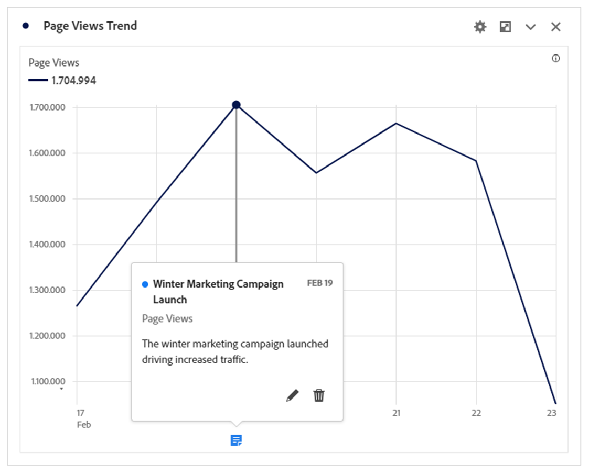
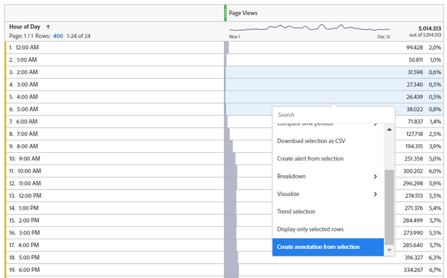
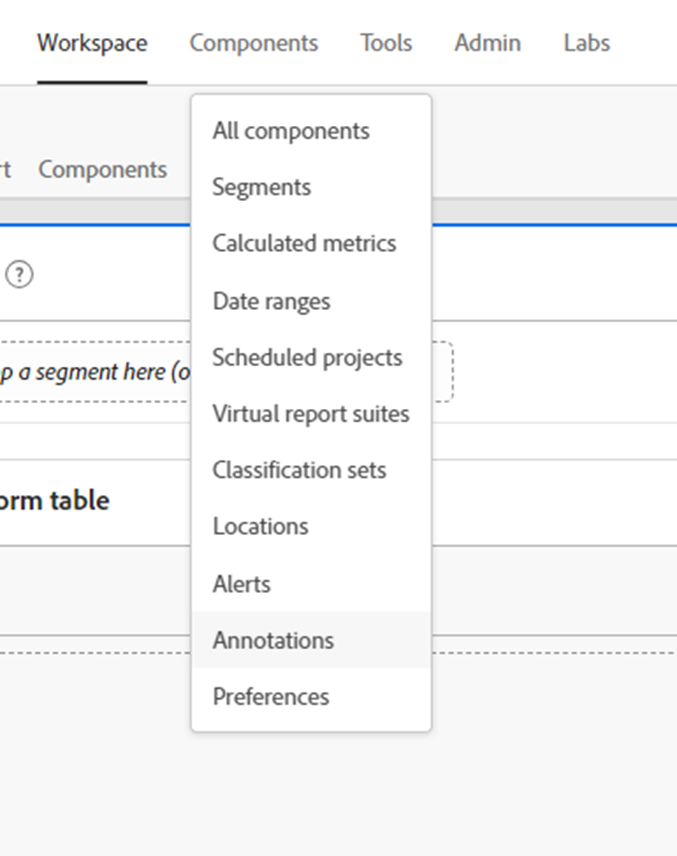
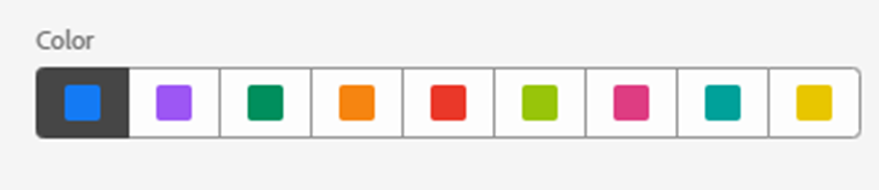
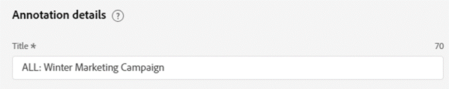
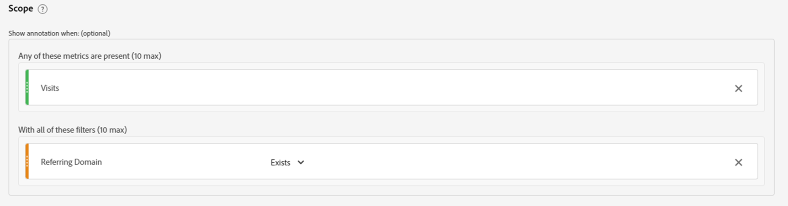
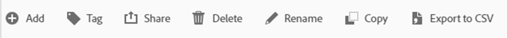
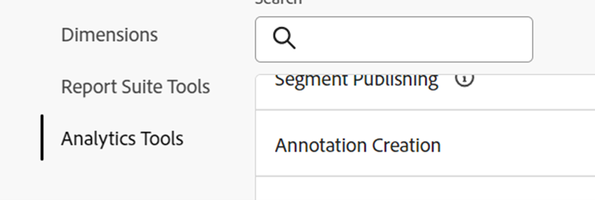

# Déverrouiller l’insight analytique ; exploiter la puissance des annotations

Le composant de données Annotations est l’une des fonctionnalités les plus simples, mais à long terme, l’une des plus rapides offertes par Adobe Analysis Workspace. Contrairement à toute autre fonctionnalité de Workspace, il sert de mémoire historique narrative pour vous et vos collègues utilisateurs de Workspace.

En d’autres termes, les annotations sont de courts textes de description qui peuvent être ajoutés aux données de tendances de dates dans Adobe Workspace. Les annotations offrent un contexte à toutes les personnes qui utilisent Analysis Workspace pour comprendre l’historique des données de votre entreprise, permettent d’analyser plus rapidement les performances et donnent à tous vos rapports une atmosphère hautement personnalisée.

## Cas d’utilisation

Il existe plusieurs situations dans lesquelles les annotations sont particulièrement utiles :

- **Valeurs aberrantes (pics et creux)** - si vous connaissez la raison des pics et des creux majeurs des données de tendance, faites un clic droit rapide sur le point de données des valeurs aberrantes et choisissez « Annoter la sélection » pour partager ces connaissances avec tout le monde.

- **Campagnes marketing et tests principaux** - comme campagnes marketing et tests (A/B, multivariés, etc.) Comme peut avoir un impact direct sur le trafic et les performances, il est facile pour tout le monde de documenter le délai de ces campagnes et tests dans les annotations.

- **Facteurs externes et événements** - qu’il s’agisse d’événements ponctuels majeurs, d’actions de la concurrence, de nouvelles mises à jour de produits ou d’événements nationaux ou mondiaux pertinents, veillez à ajouter tous les facteurs externes pertinents pour les données aux annotations.

- **Lacunes et erreurs** - vous devriez utiliser la fonction Alertes pour vous avertir de problèmes potentiels de collecte de données, mais même l&#39;équipe la plus chevronnée rencontre malheureusement une forme d&#39;erreur de collecte de données ou des lacunes temporaires de temps en temps. Les annotations sont un excellent moyen de minimiser l’impact en informant les utilisateurs que des données sont manquantes ou incomplètes.

## Procédure

La création et la modification d’annotations sont intuitives et s’expliquent presque d’elles-mêmes. Cliquez avec le bouton droit sur un point de données dans une visualisation des tendances de date ou un tableau à structure libre et choisissez « Annoter la sélection » pour créer une annotation ou utilisez la navigation principale pour « Composants > Annotations » pour créer et modifier des annotations.

{width="70%"}{width="30%"}

Pour plus d’informations sur le fonctionnement des annotations, reportez-vous au tutoriel [vidéo sur Experience League](https://experienceleague.adobe.com/fr/docs/analytics-learn/tutorials/analysis-workspace/navigating-workspace-projects/annotations-in-analysis-workspace).

## Conseils et astuces pour bien démarrer

Enfin, voici quelques conseils utiles pour commencer à utiliser immédiatement les annotations.  L’utilisation de ces suggestions permet de rendre vos annotations efficaces, claires et informatives pour tous les utilisateurs et utilisatrices.

- **Codage des couleurs** - La fonction Annotations vous permet de sélectionner une gamme de couleurs, qui apparaissent dans vos projets Workspace pour vous aider à différencier les différents types d’annotations. Si vous mesurez plusieurs sites ou applications différents, vous pouvez choisir une couleur différente pour chacun d’eux. Ou une couleur différente pour chaque catégorie d’annotations.

- **Étiquetage du titre** - Une autre façon de donner aux utilisateurs des repères visuels faciles concernant une annotation consiste à étiqueter le titre de l’annotation. Comme pour le codage par couleur, vous pouvez choisir différents libellés en fonction de la structure des données de votre organisation, par exemple par canal ou nom (à savoir WEB, APP ou ALL)

- **Portée** - Lors de la création d’une annotation, vous disposez de l’ensemble des dimensions, mesures et limiteurs afin d’afficher les annotations dans le contexte approprié. Certaines annotations ne concernent que certaines dimensions ou mesures. Vous pouvez donc limiter l’affichage d’une annotation à la dimension ou à la mesure correspondante.

- **Enregistrer sous** - Une fois que vous avez créé une ou deux annotations, vous pouvez les réutiliser en tant que modèles pour créer de nouvelles annotations, à l’aide de l’option « Enregistrer sous » qui vous permet de gagner du temps.

- **Gestionnaire d’annotations** - Utilisez la navigation principale pour accéder à « Composants > Annotations » et au gestionnaire d’annotations, où vous trouverez des fonctionnalités plus complètes pour créer et modifier en particulier les annotations.

- **Autorisations -** Si vous ne pouvez pas créer d’annotations, contactez votre administrateur qui peut autoriser la « création d’annotations » dans Admin Console.

Pour consulter la documentation détaillée, consultez la [présentation des annotations](https://experienceleague.adobe.com/fr/docs/analytics/analyze/analysis-workspace/components/annotations/overview) et les articles connexes.

## Auteur

Ce document a été rédigé par :

Thomas Edward Buckley, responsable Data Warehouse &amp; Business Intelligence chez Miles &amp; More (Lufthansa Group)
