# La magie derrière le rideau : segments complexes : exclusions, conteneurs et attribution

_Découvrez les subtilités de la segmentation de données complexe, en explorant les exclusions, les conteneurs et les modèles d’attribution. Comme un tour de passe-passe magicien, la maîtrise de ces techniques permet aux analystes d&#39;effectuer la magie des données, transformant les informations avec précision et finesse._

Les rideaux sont ouverts, la scène est prête... ce n&#39;est peut-être pas un numéro de magie de Las Vegas, mais nous pouvons faire quelques astuces assez étonnantes lors de la création de nos segments.

Dans ce module, nous allons aborder les sujets suivants :

- Exclure la logique
- Utilisation de conteneurs
- Modèle d’attribution

## Inclure ou exclure

Par défaut, tous les conteneurs commencent par le type **include**, ce qui signifie qu’ils renvoient les données correspondant aux critères. Cependant, vous pouvez également modifier le segment ou les conteneurs à l’intérieur des segments de type **exclure**, ce qui vous permet de rejeter certains critères.

Alors qu&#39;un magicien peut trouver votre carte dans le jeu, il est étonnant quand ce magicien peut faire le reste du jeu n&#39;existe pas. De même, dans les segments d’exclusion, nous voulons que les données indésirables disparaissent simplement de notre jeu de données.

Vous vous dites peut-être : « D&#39;accord, mais j&#39;ai déjà les options « N&#39;est pas égal à » et « Ne contient pas », alors cela ne devrait-il pas me couvrir ? » Malheureusement, la réponse est non... et il ne s&#39;agit pas seulement de pouvoir exclure des groupes de logique, sur un seul élément. Même lorsque vous traitez avec un seul composant, vous devrez souvent utiliser des *exclusions* pour atteindre votre objectif.

- **Ne contient pas / N’est pas égal à** - Correspond exactement à ce à quoi cela ressemble, avec une correspondance sur des éléments qui ne contiennent pas de chaîne spécifique
- **Exclure : la valeur contient / est égale à** - Les éléments *exclure* qui correspondent à la chaîne sont exclus.

À première vue, ces deux sons sont identiques... et au niveau **accès** des segments/conteneurs, vous auriez raison, car ils exécuteront la même action. Cependant, lorsque vous utilisez la portée **visite** ou **visiteur**, vous obtenez des résultats très différents.

**Figure 1 : ne contient pas / n’est pas égal à - Portée de l’accès**

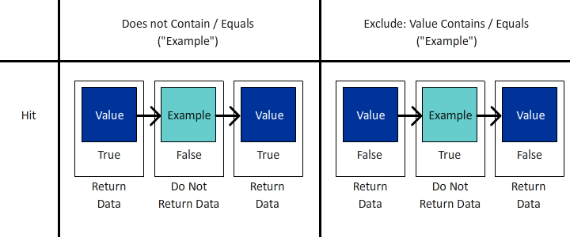

*Notez que chaque accès renvoie une valeur true ou false, et que ces valeurs sont inversées entre « ne » et « exclure*.

- Ne contient pas « Example » dans « Value » (oui), donc renvoie true, et inclut cet accès ; de même, ne contient pas « Example » (non, il l’inclut), donc renvoie false et n’inclut pas cet accès. En gros, renvoyez toutes les données qui renvoient un résultat réel.
- Est-ce que « Value » contient « Example » (non), donc renvoie false, et n’exclut pas cet accès ; de même, est-ce que « Example » contient « Example » (oui), donc renvoie true, et exclut cet accès. En gros, renvoyez des données qui n’ont **pas** de résultat réel ou renvoyez des données qui ne correspondent pas à vos critères.
- Vous pouvez constater qu’au niveau **Accès**, les deux ensembles de logiques renvoient le même ensemble de données.

**Figure 2 : ne contient pas / n’est pas égal à - Portée de la visite**

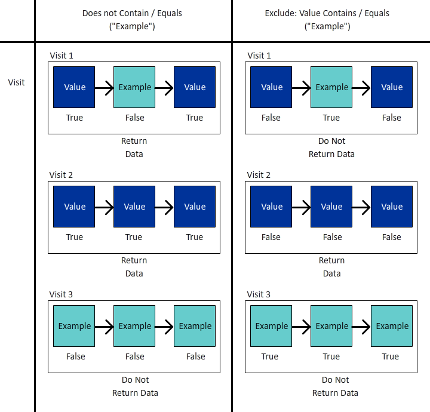

*Comme ci-dessus, chaque accès au cours de la **visite**sera évalué avec le même true/false. Cependant, le jeu de données renvoyé est celui de l’ensemble de la visite.*

- À chaque accès, « Valeur » ne contient pas « Exemple » (oui), donc renvoyez la valeur true ; de même, « Exemple » ne contient pas « Exemple » (non, il en contient), donc renvoyez la valeur false.
   - Si l’accès **any** dans la visite renvoie **true**, la **visite complète** est renvoyée.*
   - Si la visite était entièrement composée d’accès contenant « Exemple », aucun accès ne renverrait de valeur true et, par conséquent, cette visite ne serait **renvoyée** dans votre jeu de données.
- Encore une fois, à chaque accès « Example » contient « Example » (oui), donc retourne true
   - Si **tout accès** renvoie **true**, la visite entière sera **exclue**
   - Si **tous les accès** de la visite renvoient **false**, cette visite est renvoyée dans votre jeu de données
- Maintenant vous pouvez voir où cette logique commence à diverger. Dans l’exemple ci-dessus, il existe trois visites distinctes :
   - Lorsque vous utilisez « Ne contient pas / est égal à » **deux des trois** visites sont renvoyées.
   - Lorsque vous utilisez « Exclure contient/est égal à » **une seule** ces visites est renvoyée

**Figure 3 : Ne contient pas / n’est pas égal à - Portée de la visite**

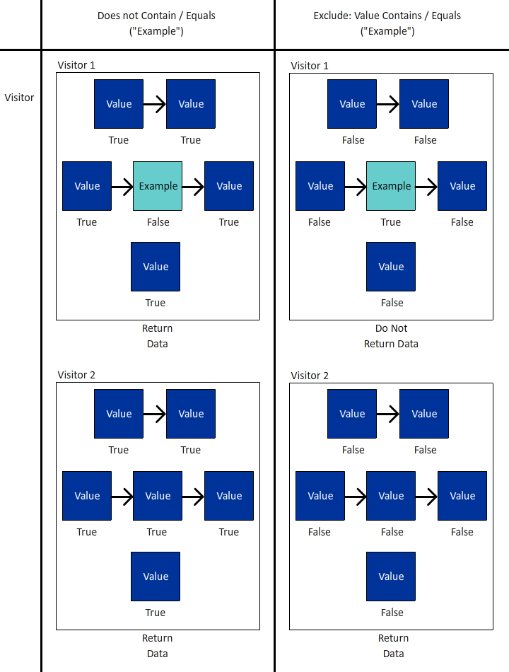

*Comme ci-dessus, chaque accès réalisé par le **visiteur**sera évalué avec la même logique vrai/faux. Cependant, nous examinons maintenant tous les accès que ce visiteur a effectués, au cours de toutes les visites (dans la période sélectionnée).*

- À chaque accès, « Valeur » ne contient pas « Exemple » (oui), donc renvoyez la valeur true ; de même, « Exemple » ne contient pas « Exemple » (non, il en contient), donc renvoyez la valeur false.
   - Si l’accès **any** effectué par le visiteur renvoie **true**, la **visite complète** est renvoyée.
   - Si le visiteur n’a jamais effectué d’accès contenant « Exemple », aucun accès ne renvoie true et, par conséquent, ce visiteur n’est **renvoyé** dans votre jeu de données.
- Encore une fois, à chaque accès « Example » contient « Example » (oui), donc retourne true.
   - Si **tout accès** renvoie **true**, le visiteur entier (et par la suite toutes ses visites) sera **exclu.**
   - Si **tous les accès** de la visite renvoient **false**, ce visiteur est renvoyé dans votre jeu de données, renvoyant ainsi avec succès les visiteurs qui n’ont pas fait « X ».
- Il s’agit d’une extension de la logique de visite, où il y a encore plus de considérations. Dans l’exemple ci-dessus, il y a deux visiteurs distincts, avec 3 visites chacun :
   - Si vous utilisez « Ne contient pas / est égal à » **les deux** les visiteurs sont renvoyés, ainsi que les **trois** de leurs visites (ce qui représente 2 visiteurs et 6 visites totales dans vos rapports)
   - Lorsque vous utilisez l’option « Exclure contient/est égal à » **un seul** de ces visiteurs est renvoyé et seules les trois visites associées à ce visiteur sont incluses (ce qui représente 1 visiteur et 3 visites totales dans vos rapports)

>[!TIP]
>
>Cette logique peut être complexe, en particulier lorsque vous commencez à imbriquer des conteneurs... Il est toujours préférable de tester les données par rapport à des exemples de données contrôlés pour s’assurer que votre segment renvoie bien les données que vous pensez qu’il devrait.

### Exemple de segment 1 : exclure les visites qui effectuent un achat

Dans cet exemple, je souhaite cibler les utilisateurs et utilisatrices qui se sont rendus sur un site et qui n’ont *pas* effectué d’achat au cours de leur visite (essentiellement, je souhaite exclure les visites qui ont effectué une transaction ; par conséquent, je resterai avec les visites qui n’ont pas terminé une transaction)

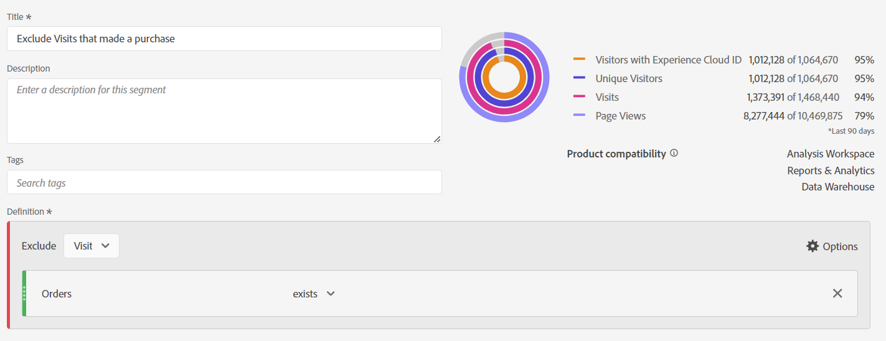

À titre de comparaison, examinons un segment créé à l’aide de « N’existe pas » :

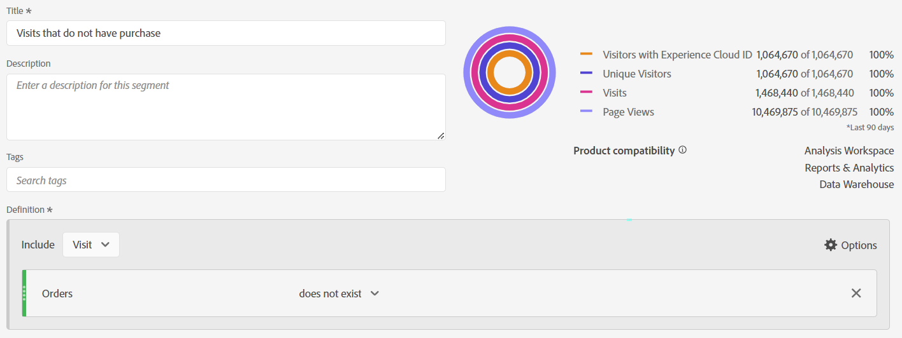

Notez que l’aperçu présente un résultat très différent... en fait, ce segment renvoie 100 % de mes visites, car chaque visite comporte au moins un accès qui n’inclut pas la mesure « Commande ».

Pour illustrer cette fonctionnalité plus en détail, comparons les deux segments côte à côte :

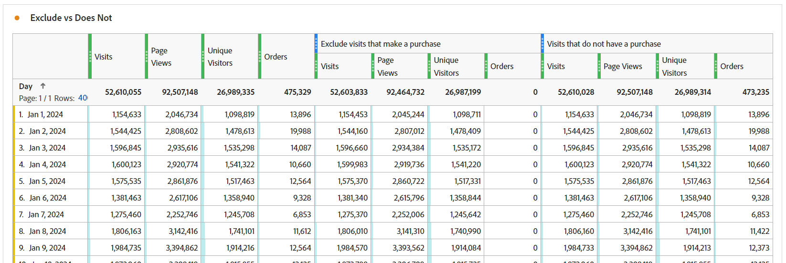

Tout d’abord, vous pouvez constater que malgré la portée au niveau *visite* du segment, nous pouvons associer le segment à d’autres mesures (telles que les pages vues ou les visiteurs uniques). Le premier ensemble de colonnes n’est pas segmenté, ce qui montre d’un seul coup d’œil que le segment (qui n’existe pas) renvoie près de 100 % des données. Seul le segment d’exclusion fait ce que nous avons besoin qu’il fasse.

La colonne la plus visible est celle des commandes, qui doit être immédiatement évidente que le conteneur « N’existe pas » est erroné, car la plupart des commandes sont toujours renvoyées.

### Exemple de segment 2 : exclure les visiteurs qui ont effectué un achat au cours de la période de création de rapports

Dans cet exemple, je souhaite utiliser les idées de l’échantillon précédent (qui portait spécifiquement sur le niveau de visite) et l’étendre pour trouver les visiteurs qui n’ont pas effectué d’achat dans la période de mon rapport.

Ce segment va ressembler beaucoup à l’exemple ci-dessus, presque identique, mais la portée du segment va faire une grande différence.

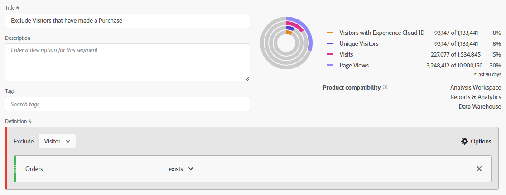

Désormais, si nous comparons le segment défini pour les visiteurs au segment défini pour les visites ci-dessus, vous verrez que beaucoup plus de données et de visites sont exclues, car *les visiteurs qui ont effectué des achats* ont également eu des visites pour lesquelles aucun achat n’a été effectué. Ces visites sont donc également exclues, car elles font partie du cycle de vie du visiteur.

>[!IMPORTANT]
>
>Lorsque vous recherchez des données de l’étendue d’un visiteur, plus votre période de rapport est longue, plus l’exclusion est importante, car de nombreux visiteurs et visiteuses seront loyaux et récurrents sur votre site (bien sûr, certains modèles d’entreprise auront un impact plus important que d’autres)

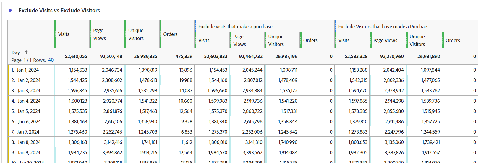

>[!IMPORTANT]
>
>Bien que les différences entre visite et visiteur puissent être *subtiles* (en particulier dans cet exemple de données), il s’agit d’une logique unique qui doit être prise en compte. Vos données peuvent être extrêmement différentes en fonction de votre site et du comportement des utilisateurs et utilisatrices.

Il est important de savoir exactement quelles données, ou quelle *histoire*, vous essayez de raconter avec votre rapport. Il est essentiel de s’assurer que vos tableaux et visualisations indiquent clairement à l’audience ***ce qui s’affiche*** et d’utiliser le modèle de segment approprié pour effectuer une analyse appropriée. Des décisions éclairées ne peuvent être prises correctement que si tout le monde comprend ce qu&#39;il regarde.

## Utilisation de conteneurs

Les conteneurs nous permettent de créer des « sous-logiques » dans la logique principale du segment. Une idée reçue est que la portée doit être la même entre le segment et le conteneur... mais ce n’est pas le cas. Cela nous donne plus de liberté pour créer des scénarios spécifiques dans le plus grand ordre des choses, pour construire une logique complexe.

La meilleure façon de penser aux conteneurs est d&#39;imaginer que chaque conteneur est une boîte, et que nous pouvons empiler des boîtes (de logique) dans une autre boîte, dans une autre boîte... mais contrairement aux boîtes physiques où chaque boîte doit être plus petite que la boîte extérieure, nous pouvons mettre quelque chose de plus grand à l&#39;intérieur si cela nous pousse à récupérer les données correctes. Pensez-y comme à un chapeau de magicien, où l&#39;impossible peut rentrer à l&#39;intérieur et nous sommes les magiciens des données...

### Champ d’application des conteneurs

Commençons par une répartition rapide de la portée du *conteneur*. Comme pour la *portée du segment*, vous disposez de vos options de base de portée **accès**, **visite** et **visiteur**, mais parfois vous verrez également quelque chose appelé **groupe logique** à la place du visiteur (cela se produit uniquement dans les segments séquentiels, et nous les aborderons dans l’article suivant).

L’ajout de conteneurs à l’intérieur de votre segment (ou dans d’autres conteneurs) peut être réalisé en accédant au menu **options*** (lors de l’imbrication de plusieurs éléments, veillez à ajouter au bon bloc - bien que vous puissiez heureusement faire glisser et déposer des conteneurs dans l’interface si vous l’ajoutez au mauvais emplacement)

**Figure 1 : ajout d&#39;un conteneur**

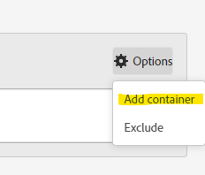

La portée d&#39;un conteneur est indépendante du parent, comme je l&#39;ai mentionné plus haut, ces *ne doivent pas correspondre* et selon ce que vous voulez retourner, vous devrez peut-être dessiner le plan pour visualiser entièrement ce dont vous avez besoin, au moins jusqu&#39;à ce que vous vous sentiez à l&#39;aise de le visualiser dans votre tête.

**Figure 2 : Portée du segment par rapport à la portée du conteneur**

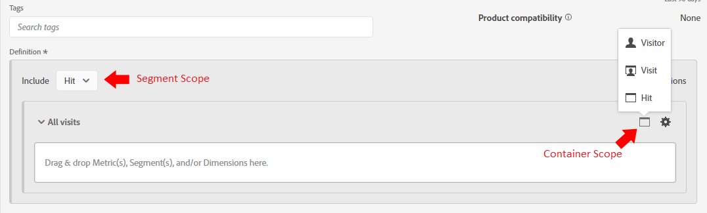

>[!NOTE]
>
>Adobe a une logique pour comprendre les segments valides et non valides, ils ne vous fourniraient pas d’options qui ne pourraient *jamais* fonctionner... donc, si vous voyez l’option d’utiliser un conteneur de la portée du visiteur dans un segment de la portée de l’accès, cela signifie qu’il s’agit d’une option valide.

Tout comme pour les segments de base, lorsque vous commencez à créer un segment complexe avec des conteneurs imbriqués, vous devez avoir une idée claire du type ***quel*** de données vous souhaitez renvoyer. ***Comment*** prévoyez-vous d’utiliser ces données ? ***Quelles*** mesures prévoyez-vous de combiner avec le segment ?

Ces questions permettent de déterminer la portée de l’ensemble du segment. C’est le point de départ de tout segment.

Ce n’est pas parce que vous prévoyez de coupler un segment avec votre mesure Visiteurs uniques que le segment lui-même doit être au niveau des visiteurs... loin de là. Un segment au niveau du visiteur renvoie toutes les données pour un visiteur... cela signifie toutes ses visites, toutes ses pages vues, etc. Une fois qu’un visiteur correspond à vos critères de segment, votre segment peut commencer à renvoyer des données du *passé* pour ce visiteur (tant qu’elles se trouvent dans la période de votre espace de travail).

>[!IMPORTANT]
>
>Même si vous envisagez de coupler un segment avec la mesure Visiteurs uniques, cela *ne signifie pas* que le segment doit automatiquement être défini pour les visiteurs... Cette idée fausse *pourrait* créer des résultats exagérés et incorrects.

J&#39;ai donc beaucoup parlé des concepts de sélection de la portée appropriée, mais je n&#39;ai pas fourni d&#39;exemples ou de détails qui vous aideront vraiment... alors plongeons-nous là-dedans maintenant avec quelques exemples de cas d&#39;utilisation réels. On dit qu&#39;un magicien ne révèle jamais ses secrets, mais ce n&#39;est pas tout à fait vrai. Dans le monde de la magie, les techniques et les rouages « derrière le rideau » sont souvent partagés avec les pairs, leur permettant de construire et d&#39;améliorer l&#39;illusion, et c&#39;est ce que je cherche à faire... pour ouvrir la porte aux possibilités qui vous attendent.

### Exemple de segment 3 : vues de pages spécifiques par des visiteurs ayant passé une commande récente (au cours de la période de création de rapports)

Dans ce scénario, je ne souhaite renvoyer qu’un ensemble de pages spécifiques qui ont été consultées par des acheteurs récents (notez que je peux toujours l’associer à des visites ou à des visiteurs uniques, même si le segment lui-même aura une portée d’accès).

Ce type de scénario est idéal si certains de mes acheteurs consultent des pages spécifiques d’un site, des pages qui peuvent ne pas être explicitement connectées à un événement spécifique.

Mon exemple va examiner les pages « Offres en vedette » et « Produits recommandés ». Actuellement, nous allons garder la logique simple et ne pas entrer dans la segmentation séquentielle (du moins pas encore, mais nous aborderons une logique plus complexe comme celle-ci dans un article futur).

Une autre question est **pourquoi** nous retirons par accès ? Techniquement, je pourrais extraire ici par Visites ou Visiteurs, mais je souhaiterais peut-être également examiner ces pages spécifiques par **pages vues (pour l’ensemble spécifique de pages) par visite** ou **pages vues (pour l’ensemble spécifique) par visiteur**, cette portée me donne la flexibilité d’effectuer ce calcul spécifique. Comme ces accès peuvent facilement être associés à des visites ou à des visiteurs uniques afin de déterminer le nombre de visites ou de visiteurs qui voient ces pages, j’opterai pour le segment le plus flexible que je peux utiliser pour tous les scénarios.

Tout d’abord, à titre de comparaison, voici un segment basé sur un accès simple pour les pages spécifiques.

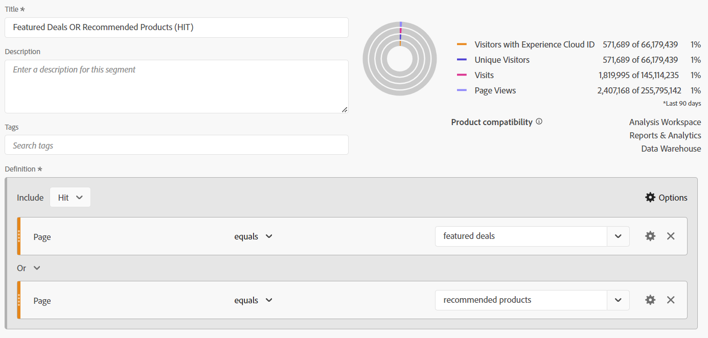

Maintenant, intégrons la complexité :

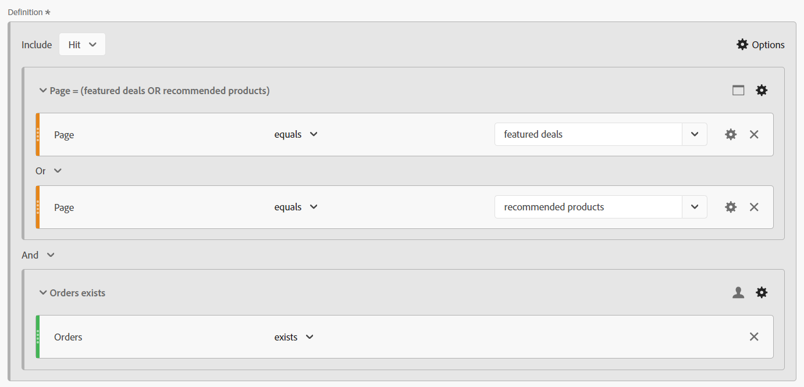

Vous remarquerez que j’utilise non seulement plusieurs conteneurs, mais que je mélange également la portée de ces conteneurs. L’ensemble du segment est au niveau d’accès, mais je recherche également les VISITEURS qui ont passé une commande.

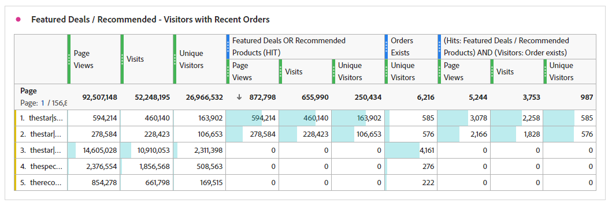

Passons un peu de temps à analyser cela, car il se passe beaucoup de choses.

Tout d’abord, au lieu d’afficher une répartition quotidienne, j’affiche une répartition des pages, car je pense que cela permettra de mieux illustrer les deux segments.

<table style="border: 0;">
    <tr>
        <td width="352" style="border: 0;">Les trois premières colonnes (Pages vues, Visites et Visiteurs uniques) ne sont pas segmentées et affichent donc toutes les pages du site. Notez que je n’ai pas inclus les commandes ici, car les commandes sont suivies sur une action et ne font donc pas partie de la portée de la dimension de page.</td>
        <td style="border: 0;">&lt;img src=« assets/segment-example-3/segment3c-comparison-table-detail1.png » width=« 352 »
        </td>
    </tr>
</table>

<table style="border: 0;">
    <tr>
        <td width="352" style="border: 0;">Ensuite, j’affiche le résultat du segment simple, en ne regardant que les <strong> accès </strong> sur les deux pages spécifiées. Vous remarquerez que les autres pages de la répartition génèrent toutes 0, comme prévu.</td>
        <td style="border: 0;">&lt;img src=« assets/segment-example-3/segment3c-comparison-table-detail2.png » width=« 352 »
        </td>
    </tr>
</table>

<table style="border: 0;">
    <tr>
        <td width="352" style="border: 0;">Maintenant, voici un petit conseil supplémentaire : avant d’afficher le résultat du segment avancé, j’ai utilisé un autre segment simple de « Il existe des commandes » (à une portée de niveau ACCÈS) et je l’ai associé à des visiteurs uniques. Cela me renverra le total des UV qui ont passé des commandes au cours de la période couverte par mon rapport, ainsi que les UV qui ont atteint chacune de ces pages... cela aidera à mieux illustrer le prochain ensemble de colonnes.</td>
        <td style="border: 0;">&lt;img src=« assets/segment-example-3/segment3c-comparison-table-detail3.png » width=« 352 »
        </td>
    </tr>
</table>

<table style="border: 0;">
    <tr>
        <td width="352" style="border: 0;">Le dernier ensemble de colonnes est empilé avec mon segment complexe. L’ensemble des UV avec commandes correspond au simple segment « La commande existe » à chaque page, mais vous remarquerez que le total est considérablement différent ; puisque cet ensemble de données limite explicitement le jeu de données aux seuls visiteurs qui ont passé des commandes ET qui accèdent aux pages, je suis explicitement intéressé.</td> <td style="border: 0;">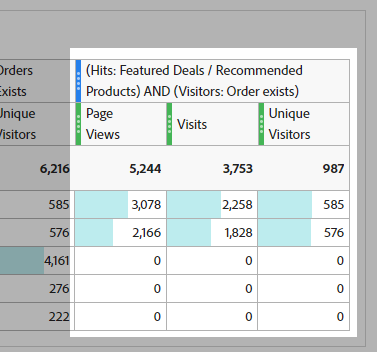
        </td>
    </tr>
</table>

### Exemple de segment 4 : visites qui ont bénéficié d’offres en vedette OU de produits recommandés ET qui passent une commande au cours de la même visite

L’exemple ci-dessus a montré comment vous pouvez ajouter un conteneur d’étendue plus grande (c’est-à-dire un visiteur) à l’intérieur d’un conteneur d’étendue plus petite (c’est-à-dire un accès). Il n’est donc pas surprenant que vous puissiez ajouter des conteneurs d’accès à l’intérieur des segments d’étendue de visiteur ou de visite.

En utilisant certaines des mêmes pages que celles que nous avons consultées précédemment, nous nous soucions maintenant de récupérer les visiteurs qui se sont produits et qui ont accédé soit aux offres en vedette SOIT à la page des produits recommandés ET qui ont passé une commande au cours de la même visite.

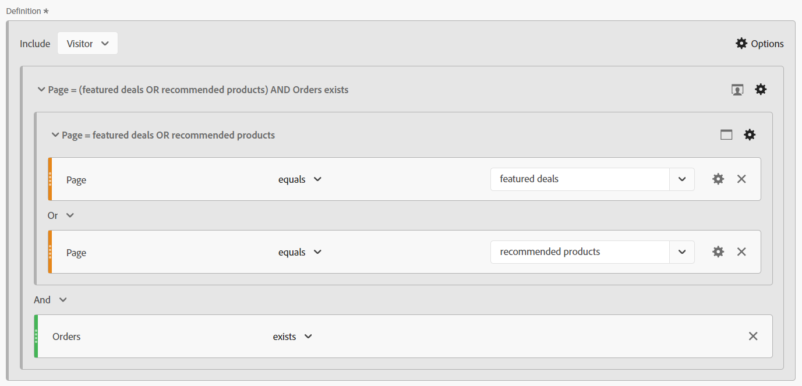

Ce segment mélange les trois portées. Le niveau supérieur du segment est visiteur, ce qui garantit que TOUS les accès de toutes les visites sont renvoyés pour le visiteur correspondant. Dans ce contexte, nous avons ajouté un conteneur d’étendue de visite, ce qui garantira que le visiteur doit avoir eu au moins une visite correspondant aux critères spécifiques de la commande ET avoir visité des pages spécifiques. Nous avons ajouté un conteneur d’étendue des accès pour les pages elles-mêmes, afin que nous puissions utiliser la logique OU pour rechercher la page d’offres en vedette OU la page de produits recommandés.

L’avantage de ce segment ciblé par les visiteurs est que cela renverra **TOUTES** les visites des visiteurs qui correspondent à ce critère. Ce segment sera donc utile si je souhaite voir les comportements des visites précédentes menant à cette combinaison, et les actions de ces visiteurs après un tel scénario.

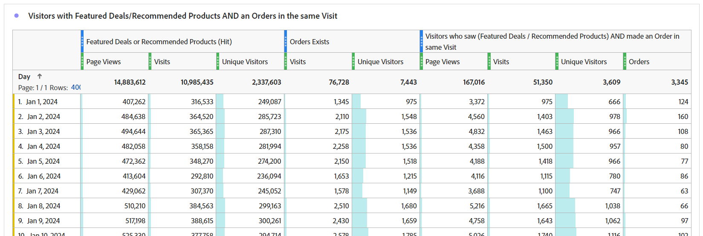

Ici, je compare les accès aux offres en vedette/au contenu recommandé, aux commandes existantes, au segment complexe où la commande et l’une des pages spécifiées existent toutes deux au cours de la même visite. Le segment complexe est l’endroit où les deux premiers segments se croisent ; mais étant donné qu’il s’agit d’une portée de visiteur, toutes les autres visites de ces visiteurs seront également renvoyées.

## Modèle d’attribution

La modélisation de l’attribution dans une définition de segment se rapporte principalement aux dimensions qui ont une expiration sans accès, donc les props (qui sont toujours au niveau de l’accès) ne sont pas vraiment un bon candidat. Vos eVars, vos canaux marketing, etc., sont toutefois exactement la raison pour laquelle ces paramètres sont conçus.

Avant d’examiner le segment, nous devons examiner rapidement le fonctionnement de la modélisation d’attribution dans un exemple simple.

Supposons que nous ayons deux eVars, que l’une d’elles soit définie pour l’expiration de la visite (eVar1) et que l’autre soit définie pour l’expiration de 30 jours (eVar2). Pour plus de simplicité, nous allons suivre une campagne interne (icid).

**Visite 1**

- Page A
   - **eVar1** n’est pas défini
   - **eVar2** n’est pas défini
- Cliquez sur Bannière de promotion avec ?icid=promo-banner dans l&#39;URL
- Page B
   - **eVar1** et **eVar2** sont définis sur « promo-banner »
   - **L’instance d’eVar1** est déclenchée
   - **L’instance d’eVar2** est déclenchée
- Page C
   - **eVar1** et **eVar2** conservent la valeur « promo-banner »
   - Aucune des mesures d’instance des eVars n’est déclenchée, car les deux eVars utilisent des valeurs persistantes

**Visite 2**

- Page D
   - **eVar1** n’est défini sur aucune valeur et aucune **instance d’eVar1** n’est déclenchée
   - **eVar2** conserve la valeur « bannière de promotion » en raison de l’expiration de 30 jours
   - **Instance d’eVar2** n’est pas déclenchée, car la valeur est persistante et n’est pas réellement définie
- Cliquez sur Promotion du rail latéral avec ?icid=promo-side-rail dans l’URL
- Page E
   - **eVar1** et **eVar2** sont définis sur « rail latéral de promotion »
   - **L’instance d’eVar1** est déclenchée
   - **L’instance d’eVar2** est déclenchée
- Page F
   - **eVar1** et **eVar2** conservent la valeur « rail latéral de promotion »
   - Aucune des mesures d’instance des eVars n’est déclenchée, car les deux eVars utilisent des valeurs persistantes

Voici actuellement le résultat attendu de ces deux visites :

<table><tr><th colspan="1" valign="top"></th><th colspan="1" valign="top"></th><th colspan="1" valign="top"><b>Pages vues</b></th><th colspan="1" valign="top"><b>Visites</b></th><th colspan="1" valign="top"><b>Instance d’eVar1</b></th><th colspan="1" valign="top"><b>Instance d’eVar2</b></th></tr>
<tr><td colspan="1" valign="top"></td><td colspan="1" valign="top"></td><td colspan="1" valign="top">6</td><td colspan="1" valign="top">2</td><td colspan="1" valign="top">2</td><td colspan="1" valign="top">2</td></tr>
<tr><td colspan="1" rowspan="7" valign="top">Page</td><td colspan="1" valign="top"></td><td colspan="1" valign="top">6</td><td colspan="1" valign="top">2</td><td colspan="1" valign="top">2</td><td colspan="1" valign="top">2</td></tr>
<tr><td colspan="1" valign="top">Page A</td><td colspan="1" valign="top">1</td><td colspan="1" valign="top">1</td><td colspan="1" valign="top">0</td><td colspan="1" valign="top">0</td></tr>
<tr><td colspan="1" valign="top">Page B</td><td colspan="1" valign="top">1</td><td colspan="1" valign="top">1</td><td colspan="1" valign="top">1</td><td colspan="1" valign="top">1</td></tr>
<tr><td colspan="1" valign="top">Page C</td><td colspan="1" valign="top">1</td><td colspan="1" valign="top">1</td><td colspan="1" valign="top">0</td><td colspan="1" valign="top">0</td></tr>
<tr><td colspan="1" valign="top">Page D</td><td colspan="1" valign="top">1</td><td colspan="1" valign="top">1</td><td colspan="1" valign="top">0</td><td colspan="1" valign="top">0</td></tr>
<tr><td colspan="1" valign="top">Page E</td><td colspan="1" valign="top">1</td><td colspan="1" valign="top">1</td><td colspan="1" valign="top">1</td><td colspan="1" valign="top">1</td></tr>
<tr><td colspan="1" valign="top">Page F</td><td colspan="1" valign="top">1</td><td colspan="1" valign="top">1</td><td colspan="1" valign="top">0</td><td colspan="1" valign="top">0</td></tr>
</table>

<table><tr><th colspan="1" valign="top"></th><th colspan="1" valign="top"></th><th colspan="1" valign="top"><b>Pages vues</b></th><th colspan="1" valign="top"><b>Visites</b></th><th colspan="1" valign="top"><b>Instance d’eVar1</b></th></tr>
<tr><td colspan="1" valign="top"></td><td colspan="1" valign="top"></td><td colspan="1" valign="top">4</td><td colspan="1" valign="top">2</td><td colspan="1" valign="top">2</td></tr>
<tr><td colspan="1" rowspan="3" valign="top">eVar1</td><td colspan="1" valign="top"></td><td colspan="1" valign="top">4</td><td colspan="1" valign="top">2</td><td colspan="1" valign="top">2</td></tr>
<tr><td colspan="1" valign="top">promo-banner</td><td colspan="1" valign="top">2</td><td colspan="1" valign="top">1</td><td colspan="1" valign="top">1</td></tr>
<tr><td colspan="1" valign="top">rail latéral de promotion</td><td colspan="1" valign="top">2</td><td colspan="1" valign="top">1</td><td colspan="1" valign="top">1</td></tr>
</table>

<table><tr><th colspan="1" valign="top"></th><th colspan="1" valign="top"></th><th colspan="1" valign="top"><b>Pages vues</b></th><th colspan="1" valign="top"><b>Visites</b></th><th colspan="1" valign="top"><b>Instance d’eVar2</b></th></tr>
<tr><td colspan="1" valign="top"></td><td colspan="1" valign="top"></td><td colspan="1" valign="top">5</td><td colspan="1" valign="top">2</td><td colspan="1" valign="top">2</td></tr>
<tr><td colspan="1" rowspan="3" valign="top">eVar2</td><td colspan="1" valign="top"></td><td colspan="1" valign="top">5</td><td colspan="1" valign="top">2</td><td colspan="1" valign="top">2</td></tr>
<tr><td colspan="1" valign="top">promo-banner</td><td colspan="1" valign="top">3</td><td colspan="1" valign="top">2</td><td colspan="1" valign="top">1</td></tr>
<tr><td colspan="1" valign="top">rail latéral de promotion</td><td colspan="1" valign="top">2</td><td colspan="1" valign="top">1</td><td colspan="1" valign="top">1</td></tr>
</table>

Maintenant, examinons où vous pouvez définir l’attribution dans votre segment.

**Figure 4 : Modèle d’attribution**

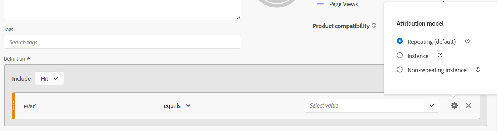

*L’icône d’engrenage de votre dimension permet de définir l’attribution. Chaque option contient des informations disponibles lorsque vous pointez sur « ? » icône. En gros :*

- Le comportement par défaut renvoie toutes les instances d’eVar où la valeur est définie (de manière spécifique ou par le biais de l’attribution set)
- L’instance renvoie uniquement la dimension pour laquelle la valeur est explicitement définie (c’est-à-dire sur les accès pour lesquels l’« instance d’eVar » est déclenchée).
- L’instance non répétitive ne renvoie la valeur que la première fois que la valeur de la dimension est définie (c’est-à-dire que, bien que cela ne soit pas couvert dans l’exemple ci-dessus, imaginez que l’utilisateur ait cliqué plusieurs fois sur la bannière de promotion, cela incrémenterait également l’« Instance d’eVar » pour chaque fois que l’utilisateur a cliqué sur la bannière, ce paramètre ne prendrait que la première instance unique de « promo-banner » et ignorerait tous les comptes ultérieurs de cette bannière)

### Exemple de segment 5 : canal marketing « Recherche payante » par rapport aux instances directes de recherche payante

Comme nous le savons tous, les canaux marketing ont un modèle d’attribution long (30 jours par défaut, mais cela peut être personnalisé en fonction de vos propres besoins). Une fois défini, le canal marketing ne sera pas remplacé par des visites « directes » ultérieures sur le site, de sorte que vos pilotes spécifiques obtiendront l’attribution de conversion. Cependant, il arrive que vous deviez voir spécifiquement les ***entrées*** sur votre site par un canal marketing spécifique ; et par entrées, je veux dire que vous devez voir quand le canal marketing est spécifiquement défini en fonction de vos règles de traitement marketing.

Changeons les choses et commençons par regarder les comparaisons, puis nous creuserons dans les segments.

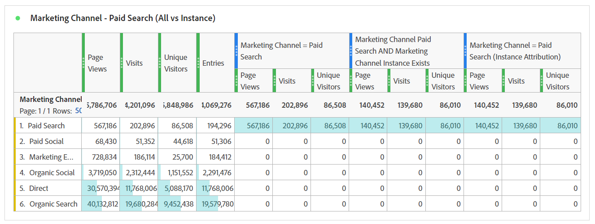

<table style="border: 0;">
    <tr>
        <td width="352" style="border: 0;">Les 4 premières colonnes ne sont pas segmentées et doivent être faciles à comprendre. Notez que *« Entrées »* est essentiellement une valeur calculée en fonction de l’endroit où les visiteurs commencent la session. Je l'ai ajouté ici pour montrer que cela ne renvoie pas les informations que nous recherchons, car les utilisateurs peuvent accéder au site par le biais de plusieurs canaux marketing (en regardant les médias sociaux, en effectuant des recherches, en cliquant sur des e-mails marketing, etc., le tout au cours de la même visite/session).</td> <td style="border: 0;">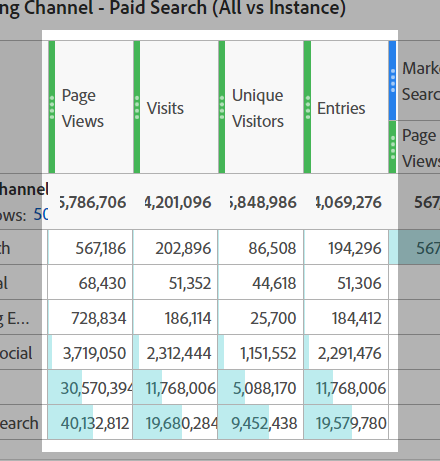
        </td>
    </tr>
</table>

<table style="border: 0;">
    <tr>
        <td width="352" style="border: 0;">L’ensemble de colonnes suivant utilise un « segment d’accès standard », examinant essentiellement les accès pour lesquels le canal marketing est « référencement payant ». Cependant, cette opération renvoie TOUS les accès en fonction de l’attribution du canal marketing. Elle n’isole pas les clics publicitaires « Recherche payante » réels. Par conséquent, cette opération ne renvoie pas les données dont nous avons besoin.</td> <td style="border: 0;">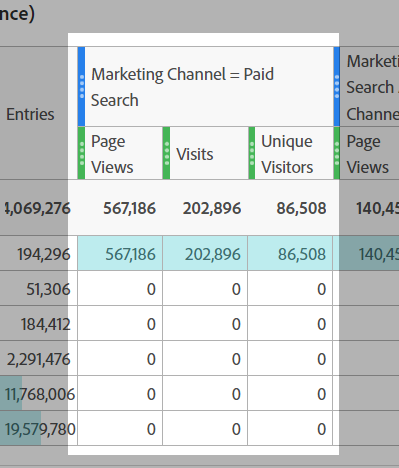
        </td>
    </tr>
</table>

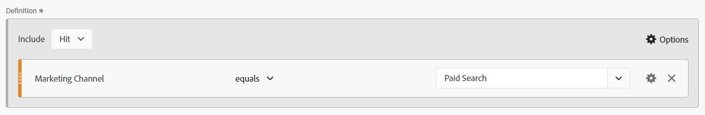

<table style="border: 0;">
    <tr>
        <td width="352" style="border: 0;">Les deux ensembles de données suivants semblent identiques, et en fait, ils renverront les mêmes données de deux manières différentes. Mais maintenant, je recherche spécifiquement les <i>instances</i> où le canal marketing a été <strong>défini</strong> sur « Référencement payant ».</td> <td style="border: 0;">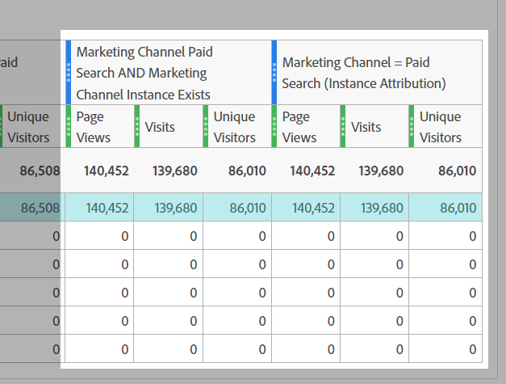
        </td>
    </tr>
</table>

Pour ce faire, deux méthodes sont possibles :

Tout d’abord, elle utilise l’attribution de dimension « standard » et l’associe à la mesure spécifique « Instance de canal marketing » (en tant que logique *existe*) :

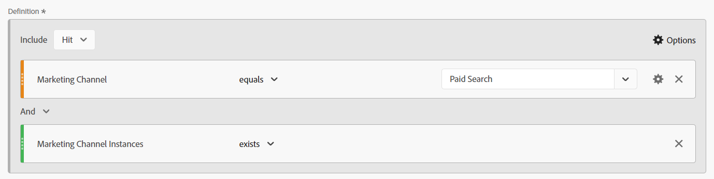

Ou, deuxièmement, pour un segment plus simple, vous pouvez modifier l’attribution en « Instance ». Notez que le nom de la dimension passera de « Canal marketing » à « Canal marketing (instance) ».

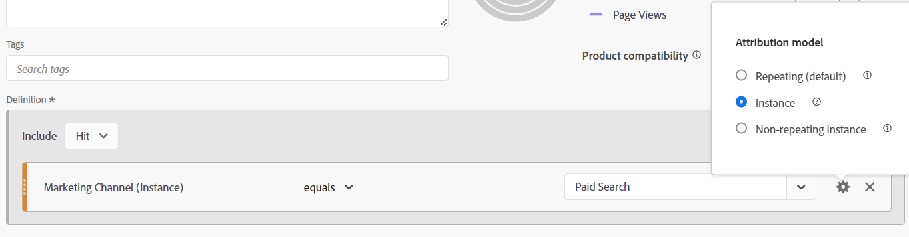

## Assemblage

Comme tout bon magicien, nous pouvons commencer avec chaque tour individuel, en construisant le public au fur et à mesure, les menant au « prestige » final. C&#39;est là que nous brillons vraiment, en prenant tous les petits trucs, et les enrouler dans une grande finale. En prenant les parties apparemment déconnectées de l&#39;astuce, et en montrant qu&#39;en fait, elles fonctionnent toutes ensemble pour former un tout cohérent.

### Exemple de segment 6 : visiteurs et visiteuses ayant passé une commande au cours d’une visite avec une instance de réseau social payant et à l’exclusion des visiteurs et visiteuses inscrits à une newsletter

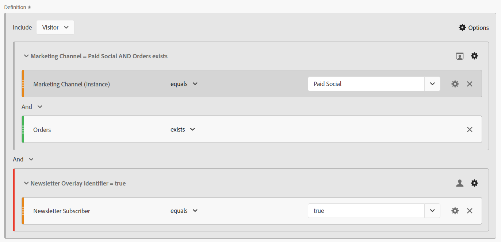

Cela me permettra d’identifier les visiteurs qui ont effectué activement un achat lors d’une visite dans le cadre d’une campagne sur les médias sociaux, mais qui ne se sont pas inscrits à nos newsletters. Cela permettra à notre équipe marketing de voir le groupe potentiel d’utilisateurs à essayer de convertir en newsletters et en e-mails marketing.

## Finale

Il y a tellement de façons de combiner la logique pour entrer dans des scénarios très détaillés, que je ne peux qu&#39;effleurer la surface des possibilités.

Comme tout grand magicien, le vrai pouvoir est d&#39;inspirer la génération montante à construire sur les bases, à réimaginer les apprentissages en quelque chose de nouveau et de merveilleux ! J&#39;ai hâte de voir ce que vous allez tous trouver !

## Auteur

Ce document a été rédigé par :

Jennifer Dungan, responsable de l’optimisation des analyses chez Torstar

Adobe Analytics Champion

