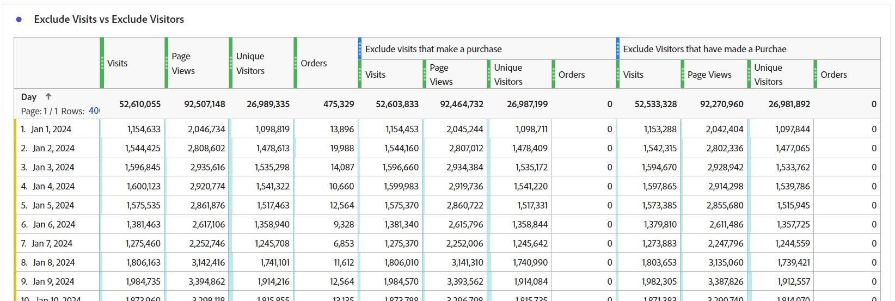

# La magie derrière le rideau : segments complexes : exclusions, conteneurs et attribution

_Découvrez les complexités de la segmentation de données complexes, en explorant les exclusions, les conteneurs et les modèles d’attribution. Tout comme la poignée de main d&#39;un magicien, la maîtrise de ces techniques permet aux analystes de faire de la magie des données, transformant ainsi les informations avec précision et finesse._

Les rideaux sont ouverts, la scène est en place...ce n&#39;est peut-être pas un acte magique de Las Vegas, mais nous pouvons faire des figures assez étonnantes lors de la construction de nos segments.

Dans ce module, nous allons couvrir :

- Exclure la logique
- Utilisation de conteneurs
- Modèle d’attribution

## Inclure ou exclure

Par défaut, tous les conteneurs commencent par le type **include** , ce qui signifie qu’ils renvoient les données qui correspondent aux critères. Cependant, vous pouvez également modifier le segment ou les conteneurs au sein des segments pour qu’ils soient de type **exclude** , ce qui vous permet de rejeter certains critères.

Alors qu&#39;un magicien peut trouver votre carte dans le jeu, c&#39;est incroyable quand ce magicien peut faire que le reste du jeu n&#39;existe pas. De même, en excluant des segments, nous voulons que les données indésirables disparaissent simplement de notre jeu de données.

Vous vous dites peut-être : &quot;Ok, mais j&#39;ai déjà les options &quot;N&#39;est pas égal à&quot; et &quot;Ne contient pas&quot;, alors ne devrait-ce pas me couvrir ?&quot; Malheureusement, la réponse est non... et il ne s&#39;agit pas seulement de pouvoir exclure des groupes logiques, sur un seul élément. Même lorsque vous traitez avec un seul composant, vous devrez souvent utiliser *excludes* pour atteindre votre objectif.

- **Ne contient pas / N’est pas égal à** - Ressemble exactement à cela, correspond à des éléments qui ne contiennent pas de chaîne spécifique.
- **Exclure : la valeur contient / equals** - Cela *exclut* les éléments qui correspondent à la chaîne

À première vue, ces deux segments sonnent de la même manière... et sur les segments/conteneurs de niveau **accès**, vous avez raison, car ils effectuent la même action. Cependant, lorsque vous utilisez la portée **visit** ou **visitor**, vous obtenez des résultats très différents.

**Figure 1 : Ne contient pas / n’est pas égal à - Étendue de l’accès**

*Notez que chaque accès renvoie une valeur true ou false, et que ces valeurs sont inversées entre ne pas exclure et ne pas exclure.*

- La &quot;valeur&quot; ne contient pas &quot;Exemple&quot; (oui), renvoie donc true et inclut cet accès ; de même, &quot;Exemple&quot; ne contient pas &quot;Exemple&quot; (non, il le contient), renvoie false et n’inclut pas cet accès. En gros, renvoyez toutes les données qui renvoient un résultat vrai.
- La &quot;valeur&quot; contient-elle &quot;Exemple&quot; (non), renvoie donc false et n’exclut pas cet accès ; de même, &quot;Exemple&quot; contient &quot;Exemple&quot; (oui), renvoie donc true et exclut cet accès. Fondamentalement, les données renvoyées qui **n’ont pas** un résultat réel ou les données renvoyées qui sont fausses selon vos critères.
- Vous pouvez constater qu’au niveau **Accès**, les deux ensembles de logiques renvoient le même ensemble de données.

**Figure 2 : Ne contient pas / n’est pas égal - Portée de la visite**

*Comme ci-dessus, chaque accès à l’intérieur de la **visite**&#x200B;est évalué avec le même vrai/faux. Cependant, le jeu de données renvoyé est celui de la visite entière.*

- Sur chaque accès &quot;Valeur&quot; ne contient pas &quot;Exemple&quot; (oui), par conséquent renvoie true ; de même, &quot;Exemple&quot; ne contient pas &quot;Exemple&quot; (non, il le contient), et renvoie false.
   - Si l’accès **n’importe quel** de la visite renvoie **true**, alors la **visite complète** est renvoyée.*
   - Si la visite est entièrement composée d’accès qui contiennent &quot;Exemple&quot;, aucun accès ne renvoie true. Par conséquent, cette visite **ne sera pas renvoyée** dans votre jeu de données.
- Encore une fois, sur chaque accès, &quot;Exemple&quot; contient &quot;Exemple&quot; (oui), et renvoie donc &quot;vrai&quot;
   - Si **accès** renvoie **true**, la visite entière sera **exclue**
   - Si **tous les accès** de la visite renvoient **false**, cette visite est renvoyée dans votre jeu de données.
- Vous pouvez voir où cette logique commence à diverger. Dans l’exemple ci-dessus, il existe trois visites distinctes :
   - Lors de l’utilisation de &quot;Ne contient pas / est égal à&quot; **deux des trois visites** seront renvoyées.
   - Lors de l&#39;utilisation de &quot;Exclure contient / Equals&quot; **, une seule** de ces visites sera renvoyée.

**Figure 3 : Ne contient pas / n’est pas égal - Portée de la visite**

*Comme ci-dessus, chaque accès effectué par le **visiteur**&#x200B;sera évalué avec la même logique true/false. Maintenant, nous examinons tous les accès effectués par ce visiteur, pour toutes les visites (au cours de la période sélectionnée).*

- Sur chaque accès &quot;Valeur&quot; ne contient pas &quot;Exemple&quot; (oui), par conséquent renvoie true ; de même, &quot;Exemple&quot; ne contient pas &quot;Exemple&quot; (non, il le contient), et renvoie false.
   - Si l’accès **n’importe quel** effectué par le visiteur renvoie **true**, alors la **visite complète** est renvoyée.
   - Si le visiteur n’a jamais effectué d’accès contenant &quot;Exemple&quot;, aucun accès ne renvoie la valeur true et, par conséquent, ce visiteur **ne sera pas renvoyé** dans votre jeu de données.
- Encore une fois, sur chaque accès, &quot;Exemple&quot; contient &quot;Exemple&quot; (oui), et renvoie donc true.
   - Si **accès** renvoie **true**, l’ensemble du visiteur (et par la suite toutes ses visites) sera **exclu.**
   - Si **tous les accès** de la visite renvoient **false**, ce visiteur est renvoyé dans votre jeu de données, retournant ainsi avec succès les visiteurs qui n’ont pas fait &quot;X&quot;.
- Il s’agit d’une extension de la logique de visite, pour laquelle il existe d’autres considérations encore. Dans l’exemple ci-dessus, il existe deux visiteurs distincts, chacun avec 3 visites :
   - Lors de l’utilisation de &quot;Ne contient pas/n’est pas égal à&quot; **, les deux** visiteurs seront renvoyés, tout comme les **trois** de leurs visites (qui représentent 2 visiteurs et 6 visites totales dans vos rapports).
   - Lors de l’utilisation de l’option &quot;Exclure contient / est égal à&quot; **, un seul** de ces visiteurs sera renvoyé, et seules les trois visites associées à ce visiteur seront incluses (qui représentent 1 visiteur et 3 visites totales dans vos rapports).

>[!TIP]
>
>Cette logique peut être complexe, en particulier lorsque vous commencez à imbriquer des conteneurs... il est toujours préférable de tester cette logique par rapport à des données d’exemple contrôlées afin de vous assurer que votre segment renvoie effectivement les données que vous pensez devoir fournir.

### Exemple de segment 1 : exclure les visites qui effectuent un achat

Dans cet exemple, je veux cibler les utilisateurs qui sont venus sur un site et qui ont effectué un achat *pas* lors de leur visite (je veux simplement exclure les visites qui ont effectué une transaction ; par conséquent, je serai laissé avec les visites qui n’ont pas effectué de transaction).

Pour effectuer une comparaison, examinons un segment créé à l’aide de &quot;N’existe pas&quot; :

Notez comment l’aperçu présente un résultat très différent... En fait, ce segment renvoie 100 % de mes visites, car chaque visite comporte au moins un accès qui n’inclut pas la mesure &quot;Commande&quot;.

Pour illustrer ce propos, comparons les deux segments côte à côte :

Tout d’abord, vous pouvez constater qu’en dépit de la portée de niveau *visite* du segment, nous pouvons associer le segment à d’autres mesures (telles que les pages vues ou les visiteurs uniques). Le premier ensemble de colonnes n’est pas segmenté, afin d’indiquer que le segment unique (qui n’existe pas) renvoie presque 100 % des données. Seul le segment d’exclusion fait ce que nous avons besoin de faire.

La colonne la plus visible est les commandes, qui doivent immédiatement indiquer que le conteneur &quot;N’existe pas&quot; est incorrect, car la plupart des commandes sont toujours en cours de renvoi.

### Exemple de segment 2 : exclure les visiteurs qui ont effectué un achat au cours de la période de rapport

Dans cet exemple, je veux utiliser les idées de l’exemple précédent (qui ont spécifiquement porté sur le niveau de visite) et les développer afin de trouver les visiteurs qui n’ont pas effectué d’achat au cours de la période de mon rapport.

Ce segment ressemblera beaucoup à l’exemple ci-dessus, presque identique, mais la portée du segment fera une grande différence.

Maintenant, si nous comparons le segment dont la portée est le visiteur au segment dont la portée est la visite ci-dessus, vous constaterez qu’un plus grand nombre de données sont exclues, et que de nombreuses autres visites sont exclues, puisque les *visiteurs qui ont effectué des achats* ont également eu des visites pour lesquelles aucun achat n’a été effectué. Ces visites sont donc également exclues, car elles font partie du cycle de vie du visiteur.

>[!IMPORTANT]
>
>Lorsque vous recherchez des données de portée visiteur, plus la période de rapport est longue, plus l’exclusion est grande, puisque de nombreux visiteurs seront des visiteurs récurrents fidèles sur votre site (bien sûr, certains modèles d’entreprise auront un impact plus important que d’autres).

>[!IMPORTANT]
>
>Bien que les différences entre visite et visiteur puissent être *subtle* (en particulier dans cet exemple de données), il s’agit d’une logique unique qui doit être prise en compte. Vos données peuvent être étonnamment différentes en fonction de votre site et des comportements des utilisateurs.

Il est important de savoir exactement quelles données, ou quelle *histoire*, vous essayez de raconter avec votre rapport. Il est essentiel de s’assurer que vos tableaux et visualisations indiquent clairement à l’audience ***ce que*** est affiché et d’utiliser le modèle de segment approprié pour effectuer une analyse appropriée. Des décisions éclairées ne peuvent être prises correctement que si chacun comprend ce qu&#39;il regarde.

## Utilisation de conteneurs

Les conteneurs nous permettent de créer une &quot;sous-logique&quot; dans la logique principale du segment, et une idée fausse courante est que la portée doit toutes être la même entre le segment et le conteneur... mais ce n’est pas le cas. Cela nous donne plus de liberté pour créer des scénarios spécifiques dans un plus grand ensemble de choses, pour construire une logique complexe.

La meilleure façon de penser aux conteneurs est d&#39;imaginer chaque conteneur comme une boîte, et que nous pouvons empiler les boîtes (de logique) dans une autre boîte, dans une autre... mais contrairement aux boîtes physiques où chaque boîte doit être plus petite que la boîte extérieure, nous pouvons mettre quelque chose de plus grand à l&#39;intérieur si cela nous amène à récupérer les données correctes. Pensez-y comme au chapeau d&#39;un magicien, où l&#39;impossible peut rentrer et nous sommes les magiciens des données...

### Portée des conteneurs

Commençons par une ventilation rapide de la portée *container*. Tout comme le segment *s* cope, vous disposez des options de base **hit**, **visit** et **visitor**, mais parfois vous verrez également quelque chose appelé **logic group** à la place du visiteur (cela se produit uniquement dans les segments séquentiels, et nous allons les aborder dans l’article suivant).

L’ajout de conteneurs à l’intérieur de votre segment (ou dans d’autres conteneurs) peut être réalisé en accédant au menu **options*** (lors de l’imbrication de plusieurs éléments, veillez à ajouter au bloc correct - bien que vous puissiez heureusement faire glisser des conteneurs dans l’interface si vous les ajoutez au mauvais emplacement).

**Figure 1 : Ajout d’un conteneur**

La portée d’un conteneur est indépendante du parent, comme je l’ai mentionné plus haut, ces *ne doivent pas* correspondre, et selon ce que vous souhaitez renvoyer, vous devrez peut-être dessiner le plan pour visualiser complètement ce dont vous avez besoin, au moins jusqu’à ce que vous soyez à l’aise avec la visualisation dans votre tête.

**Figure 2 : Étendue du segment et portée du conteneur**

>[!NOTE]
>
>Adobe a une logique pour comprendre les segments valides et non valides. Il ne vous fournit pas d’options qui peuvent *ne jamais* fonctionner.. Ainsi, si vous voyez l’option d’utilisation d’un conteneur de portée du visiteur dans un segment de portée d’accès, cela signifie que c’est une option valide.

Tout comme pour les segments de base, lorsque vous commencez à créer un segment complexe avec des conteneurs imbriqués, vous devez avoir une idée claire de ***quel*** type de données vous souhaitez renvoyer. ***Comment*** prévoyez-vous d&#39;utiliser ces données ? ***Quelles sont les mesures*** que vous prévoyez d’associer au segment ?

Ces questions vous aideront à déterminer la portée du segment dans son ensemble. Il s’agit du point de départ de n’importe quel segment.

Ce n’est pas parce que vous prévoyez d’associer un segment à votre mesure de visiteurs uniques que le segment lui-même doit être au niveau du visiteur... loin de là. Un segment au niveau du visiteur renvoie toutes les données d’un visiteur...ce qui signifie toutes ses visites, toutes ses pages vues, etc... une fois qu’un visiteur correspond à vos critères de segment, votre segment peut commencer à renvoyer les données du *passé* de ce visiteur (tant qu’il se trouve dans la plage de dates de votre espace de travail).

>[!IMPORTANT]
>
>Même si vous envisagez d’associer un segment à la mesure Visiteurs uniques, ce *ne signifie pas* que le segment doit automatiquement être défini sur la portée du visiteur... Cette idée fausse *peut* créer des résultats exagérés et incorrects.

Donc, j&#39;ai beaucoup parlé des concepts de la façon de choisir le périmètre approprié, mais pas d&#39;exemples ni de détails qui vous aideront vraiment.. alors, étudions cela maintenant avec quelques exemples de cas d&#39;utilisation réels. On dit qu&#39;un magicien ne révèle jamais ses secrets, mais ce n&#39;est pas tout à fait vrai. Dans le monde magique, les techniques et les rouages &quot;derrière le rideau&quot; sont souvent partagés avec les pairs, leur permettant de construire et d&#39;améliorer l&#39;illusion, et c&#39;est ce que j&#39;ai l&#39;intention de faire... ouvrir la porte aux possibilités qui vous attendent.

### Exemple de segment 3 : vues sur des pages spécifiques de visiteurs qui ont passé une commande récente (au cours d’une période de rapport)

Dans ce scénario, je souhaite uniquement renvoyer un ensemble de pages spécifiques qui ont été consultées par des acheteurs récents (notez que je peux toujours associer ceci à des visites ou des visiteurs uniques, même si le segment lui-même se trouve dans une portée d’accès).

Ce type de scénario est utile si des acheteurs consultent des pages spécifiques d’un site, ou des pages qui ne sont pas explicitement connectées à un événement spécifique.

Mon exemple va examiner les pages des &quot;Offres spéciales&quot; et des &quot;Produits recommandés&quot;. Actuellement, nous allons garder la logique simple et ne pas nous engager dans la segmentation séquentielle (du moins pas encore, mais nous allons nous attaquer à une logique plus complexe comme celle-ci dans un futur article).

**Pourquoi** retirons-nous les accès ? D’un point de vue technique, je pourrais y accéder en fonction des visites ou des visiteurs, mais je voudrais peut-être également consulter ces pages spécifiques en fonction des **pages vues (pour le jeu de pages spécifique) par visite** ou des **pages vues (pour le jeu spécifique) par visiteur**. Cette portée me donne la possibilité d’effectuer ces calculs spécifiques. Puisque ces accès peuvent facilement être associés à des visites ou à des visiteurs uniques afin de déterminer le nombre de visites ou de visiteurs qui consultent ces pages, je vais choisir le segment le plus flexible que je puisse utiliser pour tous les scénarios.

Tout d’abord, à des fins de comparaison, voici un segment basé sur les accès simple pour les pages spécifiques.

Maintenant, construisons la complexité :

Vous remarquerez que j&#39;utilise non seulement plusieurs conteneurs, mais que je mélange la portée de ces conteneurs. Le segment dans son ensemble se situe au niveau des accès, mais je recherche également les VISITEURS qui ont passé une commande.

Passons un peu de temps à décompresser, car il y a beaucoup de choses qui se passent.

Tout d’abord, au lieu d’afficher une ventilation quotidienne, je vous montre une ventilation de page, car je pense que cela aidera à mieux illustrer les deux segments.

<table style="border: 0;">
    <tr>
        <td width="352" style="border: 0;">Les trois premières colonnes (Pages vues, Visites et Visiteurs uniques) ne sont pas segmentées et affichent donc toutes les pages du site. Notez que je n’ai pas inclus les commandes ici, car les commandes sont suivies sur une action et ne font donc pas partie de la portée de la dimension de page.</td>
        <td style="border: 0;">&lt;img src="assets/segment-example-3/segment3c-comparison-table-detail1.png" width="352"
        </td>
    </tr>
</table>

<table style="border: 0;">
    <tr>
        <td width="352" style="border: 0;">Ensuite, je montre le résultat du segment simple, en regardant uniquement les <strong>accès</strong> sur les deux pages spécifiées. Vous remarquerez que les autres pages de la ventilation génèrent toutes 0, comme prévu.</td>
        <td style="border: 0;">&lt;img src="assets/segment-example-3/segment3c-comparison-table-detail2.png" width="352"
        </td>
    </tr>
</table>

<table style="border: 0;">
    <tr>
        <td width="352" style="border: 0;">Maintenant, voici un petit bonus, avant d’afficher le résultat du segment avancé, j’ai utilisé un autre segment simple de "Commandes existantes" (à un niveau d’accès), et je l’ai associé à des visiteurs uniques. Cela me renverra le total des UV qui ont passé des commandes pendant la période de mon rapport, ainsi que les UV qui ont touché chacune de ces pages... cela aidera à mieux illustrer le prochain ensemble de colonnes.</td>
        <td style="border: 0;">&lt;img src="assets/segment-example-3/segment3c-comparison-table-detail3.png" width="352"
        </td>
    </tr>
</table>

<table style="border: 0;">
    <tr>
        <td width="352" style="border: 0;">L’ensemble final de colonnes est empilé avec mon segment complexe. L’ensemble des UV avec commandes correspond au segment "Commandes existantes" simple à chaque page, mais vous remarquerez que le total est significativement différent. Comme cet ensemble de données limite explicitement l’ensemble de données aux visiteurs qui ont passé des commandes ET accédé aux pages, je m’intéresse explicitement.</td> <td style="border: 0;">
        </td>
    </tr>
</table>

### Exemple de segment 4 : Visites ayant atteint les offres en vedette OU les produits recommandés ET passé une commande au cours de la même visite

L’exemple ci-dessus montre comment ajouter un conteneur de portée plus grande (c’est-à-dire un visiteur) à l’intérieur d’un conteneur de portée plus petite (c’est-à-dire un accès ; il n’est donc pas surprenant que vous puissiez ajouter des conteneurs d’accès à l’intérieur des segments de portée du visiteur ou de la visite.

En utilisant certaines des mêmes pages que celles que nous avions précédemment consultées, nous voulons à présent récupérer les visiteurs qui ont eu lieu lors des offres en vedette OU de la page des produits recommandés ET qui ont passé une commande au cours de la même visite.

Ce segment mélange les trois portées. Le niveau supérieur du segment est le visiteur. Cela garantit donc que TOUS les accès de toutes les visites sont renvoyés pour le visiteur correspondant. Dans ce cas, nous avons ajouté un conteneur d’étendue de visite. Cela permettra de s’assurer que le visiteur doit avoir effectué au moins une visite correspondant aux critères spécifiques de commande ET d’avoir visité des pages spécifiques. Nous avons ajouté un conteneur de portée des accès pour les pages elles-mêmes, de sorte que nous puissions utiliser la logique OU pour rechercher la page des offres en vedette OU la page des produits recommandés.

L’avantage de ce segment à portée de visiteur est que cela renverra **TOUTES** visites des visiteurs qui correspondent à ce critère. Ce segment sera donc bénéfique si je veux voir les comportements des visites précédentes menant à cette combinaison et les actions de ces visiteurs après un tel scénario.

Ici, je compare les accès sur les offres/contenus recommandés présentés, aux commandes existantes, au segment complexe où la commande et l’une des pages spécifiées existent dans la même visite. Le segment complexe est l’endroit où les deux premiers segments se croisent ; mais comme il s’agit de la portée du visiteur, toutes les autres visites de ces visiteurs seront également renvoyées.

## Modèle d’attribution

La modélisation d’attribution dans une définition de segment concerne principalement les dimensions dont l’expiration n’est pas un accès. Par conséquent, les props (qui sont toujours au niveau des accès) ne sont pas vraiment un bon candidat. Vos eVars, canaux marketing, etc. cependant, sont vraiment les objectifs de ces paramètres.

Avant d’examiner le segment, nous devons examiner rapidement le fonctionnement de la modélisation d’attribution dans un exemple simple.

Supposons que nous ayons deux eVars, l’une d’elles étant définie sur l’expiration de la visite (eVar1) et l’autre sur une expiration de 30 jours (eVar2). Pour plus de simplicité, nous allons suivre une campagne interne (icid).

**Visite 1**

- Page A
   - **eVar1** n’est pas défini
   - **eVar2** n’est pas défini
- Cliquez sur Bannière promotionnelle avec ?icid=promo-banner dans l’URL.
- Page B
   - **eVar1** et **eVar2** sont définis sur &quot;promo-banner&quot;
   - **L’instance d’eVar1** est déclenchée
   - **L’instance d’eVar2** est déclenchée
- Page C
   - **eVar1** et **eVar2** conservent la valeur &quot;promo-banner&quot;
   - Aucune des mesures d’instance des eVars n’est déclenchée, car les deux eVars utilisent des valeurs persistantes.

**Visite 2**

- Page D
   - **eVar1** n’est défini sur aucune valeur et aucune **instance de l’eVar1** n’est déclenchée
   - **eVar2** conserve la valeur &quot;promo-banner&quot; en raison d’un délai d’expiration de 30 jours
   - **L’instance d’eVar2** n’est pas déclenchée, car la valeur est persistante et n’est pas réellement définie
- Cliquez sur Promotion du rail latéral avec ?icid=promo-side-rail dans l’URL.
- Page E
   - **eVar1** et **eVar2** sont définis sur &quot;promo-side-rail&quot;
   - **L’instance d’eVar1** est déclenchée
   - **L’instance d’eVar2** est déclenchée
- Page F
   - **eVar1** et **eVar2** conservent la valeur &quot;promo-side-rail&quot;
   - Aucune des mesures d’instance des eVars n’est déclenchée, car les deux eVars utilisent des valeurs persistantes.

Actuellement, voici le résultat attendu de ces deux visites :

<table><tr><th colspan="1" valign="top"></th><th colspan="1" valign="top"></th><th colspan="1" valign="top"><b>Pages vues</b></th><th colspan="1" valign="top"><b>Visites</b></th><th colspan="1" valign="top"><b>Instance d'eVar1</b></th><th colspan="1" valign="top"><b>Instance d'eVar2</b></th></tr>
<tr><td colspan="1" valign="top"></td><td colspan="1" valign="top"></td><td colspan="1" valign="top">6</td><td colspan="1" valign="top">2</td><td colspan="1" valign="top">2</td><td colspan="1" valign="top">2</td></tr>
<tr><td colspan="1" rowspan="7" valign="top">Page</td><td colspan="1" valign="top"></td><td colspan="1" valign="top">6</td><td colspan="1" valign="top">2</td><td colspan="1" valign="top">2</td><td colspan="1" valign="top">2</td></tr>
<tr><td colspan="1" valign="top">Page A</td><td colspan="1" valign="top">1</td><td colspan="1" valign="top">1</td><td colspan="1" valign="top">0</td><td colspan="1" valign="top">0</td></tr>
<tr><td colspan="1" valign="top">Page B</td><td colspan="1" valign="top">1</td><td colspan="1" valign="top">1</td><td colspan="1" valign="top">1</td><td colspan="1" valign="top">1</td></tr>
<tr><td colspan="1" valign="top">Page C</td><td colspan="1" valign="top">1</td><td colspan="1" valign="top">1</td><td colspan="1" valign="top">0</td><td colspan="1" valign="top">0</td></tr>
<tr><td colspan="1" valign="top">Page D</td><td colspan="1" valign="top">1</td><td colspan="1" valign="top">1</td><td colspan="1" valign="top">0</td><td colspan="1" valign="top">0</td></tr>
<tr><td colspan="1" valign="top">Page E</td><td colspan="1" valign="top">1</td><td colspan="1" valign="top">1</td><td colspan="1" valign="top">1</td><td colspan="1" valign="top">1</td></tr>
<tr><td colspan="1" valign="top">Page F</td><td colspan="1" valign="top">1</td><td colspan="1" valign="top">1</td><td colspan="1" valign="top">0</td><td colspan="1" valign="top">0</td></tr>
</table>

<table><tr><th colspan="1" valign="top"></th><th colspan="1" valign="top"></th><th colspan="1" valign="top"><b>Pages vues</b></th><th colspan="1" valign="top"><b>Visites</b></th><th colspan="1" valign="top"><b>Instance d'eVar1</b></th></tr>
<tr><td colspan="1" valign="top"></td><td colspan="1" valign="top"></td><td colspan="1" valign="top">4</td><td colspan="1" valign="top">2</td><td colspan="1" valign="top">2</td></tr>
<tr><td colspan="1" rowspan="3" valign="top">eVar1</td><td colspan="1" valign="top"></td><td colspan="1" valign="top">4</td><td colspan="1" valign="top">2</td><td colspan="1" valign="top">2</td></tr>
<tr><td colspan="1" valign="top">promo-banner</td><td colspan="1" valign="top">2</td><td colspan="1" valign="top">1</td><td colspan="1" valign="top">1</td></tr>
<tr><td colspan="1" valign="top">promo-side-rail</td><td colspan="1" valign="top">2</td><td colspan="1" valign="top">1</td><td colspan="1" valign="top">1</td></tr>
</table>

<table><tr><th colspan="1" valign="top"></th><th colspan="1" valign="top"></th><th colspan="1" valign="top"><b>Pages vues</b></th><th colspan="1" valign="top"><b>Visites</b></th><th colspan="1" valign="top"><b>Instance d'eVar2</b></th></tr>
<tr><td colspan="1" valign="top"></td><td colspan="1" valign="top"></td><td colspan="1" valign="top">5</td><td colspan="1" valign="top">2</td><td colspan="1" valign="top">2</td></tr>
<tr><td colspan="1" rowspan="3" valign="top">eVar2</td><td colspan="1" valign="top"></td><td colspan="1" valign="top">5</td><td colspan="1" valign="top">2</td><td colspan="1" valign="top">2</td></tr>
<tr><td colspan="1" valign="top">promo-banner</td><td colspan="1" valign="top">3</td><td colspan="1" valign="top">2</td><td colspan="1" valign="top">1</td></tr>
<tr><td colspan="1" valign="top">promo-side-rail</td><td colspan="1" valign="top">2</td><td colspan="1" valign="top">1</td><td colspan="1" valign="top">1</td></tr>
</table>

Maintenant, regardons où vous pouvez définir l’attribution dans votre segment.

**Figure 4 : Modèle d’attribution**

*L’icône d’engrenage sur votre dimension permet de définir l’attribution. Chaque option contient des informations disponibles lorsque vous placez le pointeur de la souris sur &quot;?&quot;. Icône Fondamentalement :*

- Le comportement par défaut renvoie toutes les instances de l’eVar où la valeur est définie (spécifiquement ou via l’attribution définie).
- L’instance ne renvoie que la dimension où la valeur est explicitement définie (c’est-à-dire sur les accès où l’&quot;instance de l’eVar&quot; est déclenchée).
- L’instance non répétée ne renvoie que la première fois que la valeur de la dimension est définie (c’est-à-dire, bien qu’elle ne soit pas traitée dans l’exemple ci-dessus, imaginez que l’utilisateur ait cliqué plusieurs fois sur la bannière de promotion, cela incrémenterait également &quot;Instance d’eVar&quot; pour chaque clic sur la bannière, ce paramètre ne prendrait que la première instance unique de &quot;bannière de promotion&quot; et ignorerait tous les comptages ultérieurs).

### Exemple de segment 5 : canal marketing &quot;Recherche payante&quot; par rapport aux instances directes de recherche payante

Comme nous le savons tous, les canaux marketing ont un modèle d’attribution long (30 jours par défaut, mais il peut être personnalisé selon vos besoins). Une fois défini, le canal marketing ne sera pas remplacé par les visites &quot;directes&quot; suivantes sur le site, de sorte que vos pilotes spécifiques obtiennent l’attribution de conversion. Cependant, il arrive que vous deviez voir spécifiquement les ***entrées*** sur votre site selon un canal marketing spécifique ; et par entrées, je veux dire que vous devez voir quand le canal marketing est spécifiquement défini en fonction de vos règles de traitement marketing.

Changeons les choses et commençons par regarder les comparaisons, puis nous allons creuser dans les segments.

<table style="border: 0;">
    <tr>
        <td width="352" style="border: 0;">Les 4 premières colonnes ne sont pas segmentées et devraient être faciles à comprendre. Notez que *"Entrées"* est essentiellement une valeur calculée basée sur l’endroit où les visiteurs démarrent la session. Je l'ai ajouté ici pour montrer que cela ne renvoie pas les informations recherchées, car les utilisateurs peuvent accéder au site par plusieurs canaux marketing (en regardant les médias sociaux, en effectuant des recherches, en cliquant sur des emails marketing, etc.). tous dans la même visite/session).</td> <td style="border: 0;">
        </td>
    </tr>
</table>

<table style="border: 0;">
    <tr>
        <td width="352" style="border: 0;">L’ensemble de colonnes suivant utilise un "segment d’accès standard", qui examine essentiellement les accès pour lesquels le canal marketing est "recherche payante". Toutefois, cela renverra TOUS les accès en fonction de l’attribution Canal marketing, mais sans isoler les clics publicitaires "Recherche payante" réels. Par conséquent, cela ne renverra pas les données dont nous avons besoin.</td> <td style="border: 0;">
        </td>
    </tr>
</table>

<table style="border: 0;">
    <tr>
        <td width="352" style="border: 0;">Maintenant, les deux prochains ensembles de données semblent identiques, et en fait, ils retourneront les mêmes données de deux manières différentes. Mais maintenant, je recherche spécifiquement les <i>instances</i> où le canal marketing était <strong>défini</strong> sur "Recherche payante".</td> <td style="border: 0;">
        </td>
    </tr>
</table>

Cela peut se faire de deux façons :

Tout d’abord, cela utilise l’attribution de dimension &quot;standard&quot; et l’association avec la mesure spécifique &quot;Instance de canal marketing&quot; (comme une logique *exists*) :

Deuxièmement, pour un segment plus simple, vous pouvez modifier l’attribution en &quot;Instance&quot;. Notez que le nom de la dimension passera de &quot;Canal marketing&quot; à &quot;Canal marketing (instance)&quot;.

## Rejoindre tout

Comme n&#39;importe quel bon magicien, nous pouvons commencer par chaque tour, construire le public au fur et à mesure, et les mener au &quot;prestige&quot; final. C&#39;est là que nous brillons vraiment, en prenant tous les petits tours, et en les retroussant dans une grande finale. En prenant les parties apparemment déconnectées du tour, et en montrant qu&#39;en fait, ils travaillent tous ensemble pour former un tout cohérent.

### Exemple de segment 6 : visiteurs qui ont passé une commande au cours d’une visite avec une instance sociale payante et excluant les visiteurs qui ont été inscrits à une newsletter

Cela me permettra d’identifier les visiteurs qui ont activement effectué un achat au cours d’une visite d’une campagne de médias sociaux, mais qui ne se sont pas inscrits à nos newsletters. Cela permettra à notre équipe marketing d’identifier le groupe d’utilisateurs potentiel à essayer de se convertir pour les newsletters et les emails marketing.

## Finale

Il y a tellement de façons de combiner la logique pour entrer dans des scénarios très détaillés, que je ne peux qu&#39;égratigner les possibilités.

Comme n&#39;importe quel grand magicien, le vrai pouvoir est d&#39;inspirer la génération montante pour construire sur les bases, pour ré-imaginer les leçons en quelque chose de nouveau et de merveilleux ! J&#39;ai hâte de voir ce que vous obtenez tous !

## Auteur

Ce document a été rédigé par :

Jennifer Dungan, responsable de l’optimisation chez Torstar

Champion Adobe Analytics

