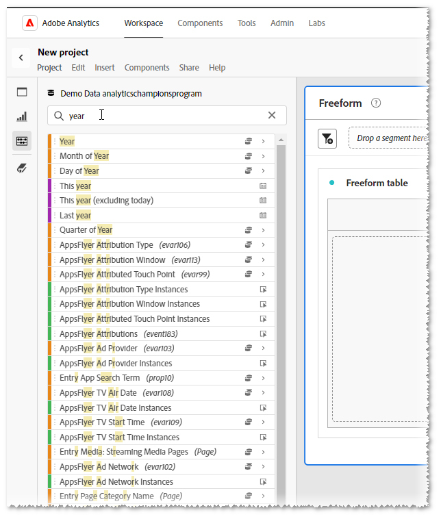
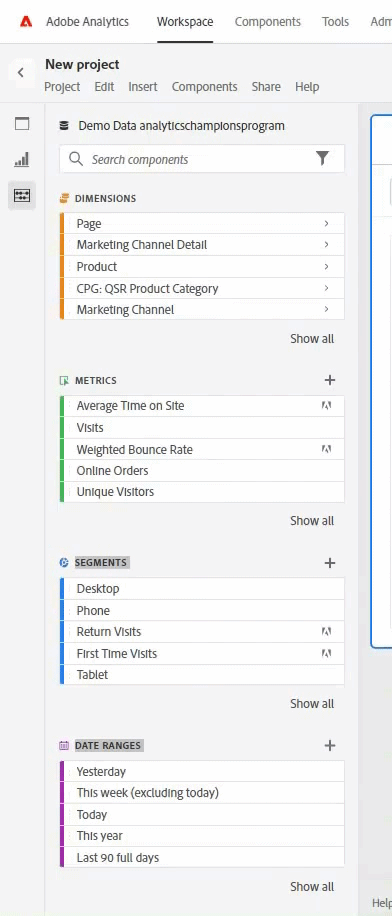
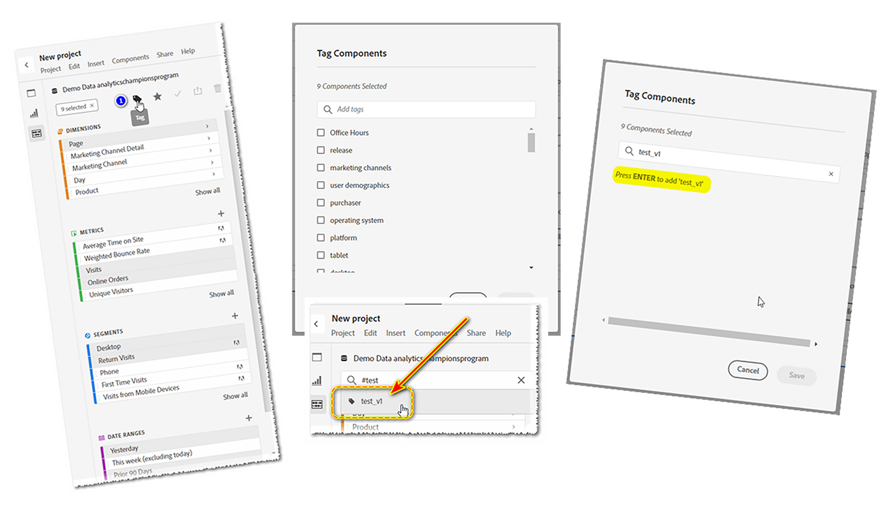
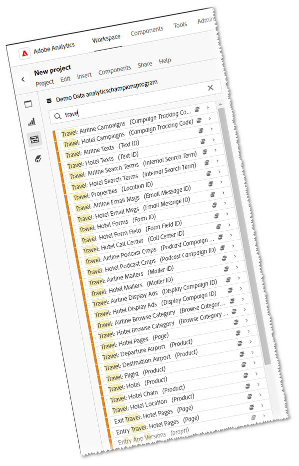
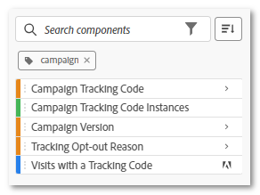

# Balises - votre assistant personnel

_Découvrez comment #TAGS pouvez rationaliser vos analyses numériques, en faisant office d’assistant personnel pour trouver efficacement ce dont vous avez besoin. Jeff Bloomer, champion Adobe Analytics, partage les points de vue d’experts sur l’optimisation du potentiel de l’outil pour votre bénéfice._

Tout le monde se souvient d&#39;avoir joué à un bon jeu de balise ou même de se cacher et de chercher, quand nous étions enfants, n&#39;est-ce pas ?

Le meilleur moment, c&#39;était quand nous étions ceux qui sont retournés à la base (tag) ou qui sont restés cachés le plus longtemps (cache-cache) jusqu&#39;à ce que nous entendions quelqu&#39;un crier, « Olly Olly bœufs libre ! » (« Vous êtes tous libres », d&#39;après l&#39;allemand : « alle alle auch sind frei ! »).  Ce qui signifiait finalement que tout le monde était arrivé à la base, avait été trouvé, ou quelqu&#39;un avait été marqué « it », et nous étions toujours libres de jouer une autre partie !

Le plus important, c&#39;est que le jeu était de marquer ou de cacher et de chercher, nous étions en train de jouer une activité amusante où tout le monde était retrouvé encore et encore.

Lorsque nous nous tournons vers nos tâches quotidiennes, la recherche de choses semble devenir beaucoup moins aventureuse et beaucoup plus fastidieuse. Mais il n&#39;est pas nécessaire que ce soit le cas si nous sommes prêts à mettre un peu de travail en amont.  Une phrase bien connue de ma famille est, « La plupart de la douleur est auto-infligée. » Cependant, bien que cela puisse sembler un peu vieux jeu ces temps-ci, il y a une phrase plus célèbre qui est également très pertinente dans cette situation : « Un point dans le temps en sauve neuf. » - Benjamin Franklin

Maintenant que j&#39;ai votre attention, permettez-moi de commencer par poser une question :

Combien d&#39;entre vous l&#39;ont fait ?  Vous avez commencé à rechercher une **dimension**, **période**, **segment** ou **mesure calculée** et vous êtes inondé de cette liste géante (voir **Figure 1**) de tout ce que vous ne voulez PAS.  **&#x200B;**&#x200B;** pense qu&#39;il essaie d&#39;être utile, mais en réalité, il a seulement réussi à ne pas être utile du tout.

*Figure 1 - Recherche de « année »*

Mieux encore, vous avez créé de *nouvelles* **périodes** et **segments**, et comme ils sont « tellement nouveaux », vous penseriez qu’au moins ces éléments devraient être rapides et faciles à trouver la prochaine fois que vous irez dans ***Adobe Workspace***. Ai-je raison ?

Eh bien, je déteste faire éclater votre bulle, mais essayez simplement de quitter **&#x200B;**&#x200B;** après avoir créé tous vos nouveaux « petits amis », et quand vous revenez, la majorité d&#39;entre eux se sont simplement enfuis.  Si vous avez de la chance, *peut-être* l&#39;un d&#39;eux est resté pour vous attendre, mais le reste est déjà parti depuis longtemps et joue à cache-cache.

## Réécrire le règlement

Donc, c&#39;est le jeu depuis le premier jour, mais si nous pouvions changer les règles ?

Et si nous pouvions créer notre propre assistant personnel pour changer ces règles pour de bon ?

Sérieusement, ce dont nous parlons ici, c&#39;est de la LSPA !  C&#39;est vrai!!  C&#39;est notre ami le hashtag, anciennement connu sous le nom de « numéro » et « signe de la livre », tout comme nous l&#39;avons vu sur nos téléphones.  Ceux d&#39;entre nous qui sommes musiciens l&#39;appellent même « aiguisée ».

Pour ceux d&#39;entre vous qui *vraiment* besoin d&#39;un rappel, cela ressemble à ceci : **#**

Quoi qu&#39;il en soit, la raison pour laquelle nous parlons de **&#x200B;**&#x200B;est qu&#39;ils sont mis dans ce « compartiment optionnel » de « trucs ennuyeux et fastidieux, dégoûtants » que tout le monde a tendance à ignorer (comme les Descriptions), parce que nous sommes tous si pressés de créer les choses les plus importantes comme, oh je ne sais pas -

- Rapports Workspace
- Segments
- Mesures calculées
- Périodes

Regardez les choses en face !  Tout ce que vous voulez, nous avons vu et entendu toutes les excuses pour lesquelles ils sont ignorés :

« Oh, salut, mais c&#39;est facile.  Je peux toujours revenir plus tard et simplement mettre à jour ces choses lors de quelques pauses déjeuner, ou peut-être même pendant que je suis assis à une conférence et *que tout soit rattrapé* », a dit tout le monde qui NE L&#39;A JAMAIS FAIT.

## Contenu de la boîte à outils

**&#x200B;**&#x200B;a même fait du service WE THE PEOPLE le service de création d&#39;un ensemble choisi de #TAGS prêts à l&#39;emploi, parce que, eh bien... il fallait bien qu&#39;ils nous lancent quelque part.  Je vais ajouter quelques mises en garde dans quelques instants, mais ce que je vous montre d&#39;abord vous en donnera le plus pour votre argent !

Avant de créer l’une des vôtres, vous devez d’abord savoir comment rechercher des **balises** existantes :

Que vous soyez dans un projet nouveau ou existant, tout ce dont vous avez besoin est d’accéder à la barre de recherche des composants, de saisir un #hashtag, ainsi que l’un de ces termes principaux (il vous suffit de regarder la vidéo), puis d’appuyer sur ENTRÉE ; ou vous pouvez simplement commencer à faire défiler l’écran jusqu’à ce que vous trouviez un terme reconnaissable.

PREMIER AVERTISSEMENT : gardez à l’esprit que si vous respectez les conventions de dénomination appropriées lorsque vous commencez à créer vos *propres* balises, à peu près chaque balise *en majuscules* que vous voyez *devrait*, et je ferai attention à ce mot « devrait » être un élément balisé **Adobe** prêt à l’emploi.  En d’autres termes, assurez-vous que toutes les balises que vous créez sont en **minuscules**.

## Créer votre propre assistant personnel

Revenons maintenant à ce que j&#39;ai dit plus tôt au sujet d&#39;un « assistant personnel ».  Et si je vous disais, que vous pourriez commencer à sélectionner certains de vos composants préférés, existants et ensuite simplement en faire les SEULS que vous voyez ?

balises 

1. Si vous commencez à sélectionner plusieurs composants (Ctrl + Clic gauche), vous remarquerez que des icônes s’affichent en haut.  L’une d’elles sera l’icône BALISE .
1. Cliquez dessus, puis la boîte de dialogue BALISES s’ouvre. Vous pouvez alors afficher les balises existantes associées à ces composants.
1. C’est à partir de cet écran que vous pouvez ensuite attribuer toutes les balises **supplémentaires/nouvelles** que vous souhaitez à ce stade.  (Exemple : **test\_v1**)
1. Pour ajouter une NOUVELLE balise à un composant, appuyez simplement sur **ENTRÉE** sur le clavier avant de cliquer sur le bouton ENREGISTRER.
1. Ensuite, lorsque vous avez attribué votre nouvelle BALISE, vous pouvez la rechercher en saisissant le hashtag(#), ainsi que votre nouvelle BALISE.

Excusez le jeu de mots, mais « #tag, c&#39;est toi ! »  Tu t&#39;es économisé beaucoup moins en cherchant à l&#39;avenir !  Maintenant, vous pouvez voir où votre diligence raisonnable et votre travail acharné entreront finalement en jeu.

## Mettre votre assistant personnel au travail

Supposons que nous travaillions dans l&#39;industrie **du voyage** et que nous préparions un rapport pour leurs **heures de bureau principales**.  Si nous commencions à effectuer une recherche uniquement sur le terme « VOYAGE », nous pourrions obtenir beaucoup plus de résultats que nécessaire.  En fait, si nous affichions un **&#x200B;**&#x200B;contenant ne serait-ce que la moitié des résultats dont nous avions besoin, les composants ne resteraient pas facilement disponibles.

Cependant, si tout au long de notre travail quotidien, nous avons régulièrement tagué nos **segments**, **mesures** et autres **composants** pertinents au fur et à mesure, et peut-être en avons-nous créé quelques nouveaux au moment de notre création de notre **espace de travail**, nous avons sérieusement démontré comment nous pouvons réécrire le règlement en notre faveur !

Dans ce cas, j’ai créé un #tag simple pour tous ces éléments nommés : #core.

Au fur et à mesure que vous continuerez à intégrer cela à vos habitudes de travail et à améliorer vos compétences pour le faire encore et encore, vous vous rendrez compte que l&#39;utilisation de #tags ressemblera davantage à celle d&#39;un assistant personnel.

Vous voulez d’autres exemples concrets ? Tenez compte des points suivants :

1. Par exemple, que diriez-vous d’un moyen facile de trouver vos **segments** et vos **périodes** pour **tous les trimestres** en **2023** ?

   

   *Un conseil supplémentaire* : ce petit carré à droite vous permettra même de changer votre ordre de tri en *alphabétique* !

1. Bien sûr, tout le monde utilise **des codes de suivi de campagne** dans une certaine mesure.  Si vous souhaitez garder une vue claire de *vos* **jouets, pensez à ajouter des**#tags aux éléments principaux que vous avez vraiment besoin de voir et à filtrer tous les autres bruits :

## Maintenant, allez jouer dehors !

Bien sûr, se cacher et chercher était amusant comme un enfant, mais maintenant nous sommes adultes.  Nous n&#39;avons pas le temps d&#39;être constamment à la recherche des choses importantes, alors assurez-vous de vous faire une faveur et ne perdez pas plus de temps à combattre l&#39;outil.  Réécrivez les règles et faites fonctionner l’outil pour vous.

### Tag, c&#39;est fait !

## Auteur

Ce document a été rédigé par :

**Jeff Bloomer**, responsable, Analyses numériques chez Kroger Personal Finance

Adobe Analytics Champion
